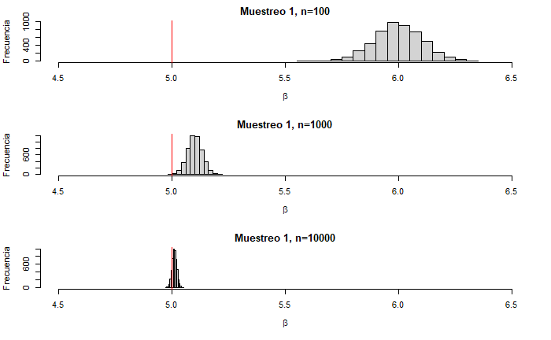
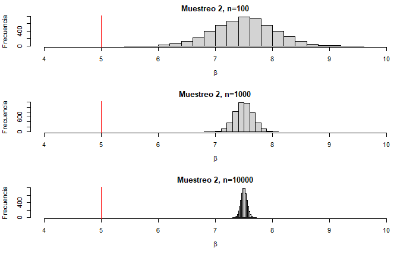
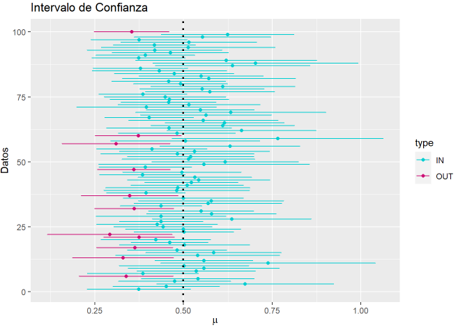

<center> <h1>Tarea 2: Frequentist Inference </h1> </center>
<center><strong>CC6104: Statistical Thinking</strong></center>
#### **Integrantes :** 

- Matías Seda

#### **Cuerpo Docente:**

- Profesor: Felipe Bravo M.
- Auxiliar: Sebastian Bustos e Ignacio Meza D.
            

#### **Fecha límite de entrega:**

### **Índice:**

1. [Objetivo](#id1)
2. [Instrucciones](#id2)
3. [Referencias](#id3)
2. [Primera Parte: Preguntas Teóricas](#id4)
3. [Segunda Parte: Elaboración de Código](#id5)

### **Objetivo**<a name="id1"></a>

Bienvenid@s a la segunda tarea del curso Statistical Thinking. Esta tarea tiene como objetivo evaluar los contenidos teóricos de la segunda parte del curso, los cuales se enfocan principalmente en inferencia estadística, diseño de experimentos y test de hipótesis. Si aún no han visto las clases, se recomienda visitar los enlaces de las referencias.

La tarea consta de una parte teórica que busca evaluar conceptos vistos en clases. Seguido por una parte práctica con el fin de introducirlos a la programación en R enfocada en el análisis estadístico de datos. 

### **Instrucciones:**<a name="id2"></a>

- La tarea se realiza en grupos de **máximo 2 personas**. Pero no existe problema si usted desea hacerla de forma individual.
- La entrega es a través de u-cursos a más tardar el día estipulado en la misma plataforma. A las tareas atrasadas se les descontará un punto por día.
- El formato de entrega es este mismo **Rmarkdown** y un **html** con la tarea desarrollada. Por favor compruebe que todas las celdas han sido ejecutadas en el archivo html.
- Al momento de la revisión tu código será ejecutado. Por favor verifica que tu entrega no tenga errores de compilación.
- No serán revisadas tareas desarrolladas en Python.
- Está **PROHIBIDO** la copia o compartir las respuestas entre integrantes de diferentes grupos.
- Pueden realizar consultas de la tarea a través de U-cursos y/o del canal de Discord del curso. 


### **Referencias:**<a name="id3"></a>

Slides de las clases:

- [Introduction to Statistical Inference](https://github.com/dccuchile/CC6104/blob/master/slides/ST-inference.pdf)
- [Design of Experiments & Hypothesis Testing](https://github.com/dccuchile/CC6104/blob/master/slides/ST-hypothesis.pdf)

Enlaces a videos de las clases:

- Introduction to Statistical Inference: [video1](https://youtu.be/A0BAhO9_RSI) [video2](https://youtu.be/6Io555e2stM) [video3](https://youtu.be/2-Q2f6zmTns) [video4](https://youtu.be/Hp2A5EJoXbk) [video5](https://youtu.be/M0Ag4bww7Q0) [video6](https://youtu.be/K7khgecup3I) [video7](https://youtu.be/uZ126Lh3L-k) [video8](https://youtu.be/kHSPx99nJ7g)
- Design of Experiments & Hypothesis Testing: [video1](https://youtu.be/3MueyHnNNig) [video2](https://youtu.be/JuyIrya23E0) [video3](https://youtu.be/OXTyG6DIvK4) [video4](https://youtu.be/95QeSwrNoLI) [video5](https://youtu.be/ZCr3WCdc-54) [video6](https://youtu.be/T6ZR0KoKhBQ)

Documentación:

- [ggplot2](https://ggplot2.tidyverse.org/)

# Primera Parte: Preguntas Teóricas<a name="id4"></a>
A continuación, se presentaran diferentes preguntas que abordan las temáticas vistas en clases. Por favor responda cada una de estas de forma breve.

#### **Pregunta 1:**
A continuación, se presenta una serie de declaraciones relacionadas con el sesgo en el muestreo, señale de forma breve el tipo de sesgo que se observa y como podría solucionar el problema de sesgo. Si no observa sesgo en alguna de las declaraciones, comente solamente que es un experimento sin sesgo:

  1. La Tercera quiere conocer la opinión de la gente sobre una propuesta de ley sobre el matrimonio igualitario. Un reportero del diario sale de la central ubicada en Las Condes y selecciona al azar a 300 personas que pasean por allí, preguntándoles sobre la ley propuesta. ¿Qué podemos decir de este plan de muestreo?.

> Es un muestreo sesgado ya que el reportero solo obtendrá la opinión de, probablemente, habitantes de la comuna de Las Condes (y, claramente, la opinión de los habitantes de Las Condes no repesenta la opinión de Chile respecto a una propuesta de ley sobre el matrimonio igualitario). Por tanto, se tiene que hay sesgo de selección (en particular, un sesgo de conveniencia por que el reportero crea su muestra de forma muy simple ya que, en su posición, es lo más fácil). Para solucionar dicho sesgo, se tendría que *diversificar* el muestreo. En este caso, se necesita obtener la opinión de personas de grupos socio-económicos más variados y la opinión de personas de regiones.

  2. Una empresa de telefonía quiere conocer el grado de satisfacción de los propietarios de su nuevo servicio 5g, para ver que tal es la calidad del servicio entregado. Para ello, selecciona al azar 500 números entre todo el conjunto de clientes, colocándose en contacto telefónico con ellos. ¿Qué podemos decir de este plan de muestreo?

> El plan no suena tan correcto ya que, en este caso, realizar un muestreo aleatorio estratificado sería mejor idea puesto que, como probablemente la empresa de telefonía entrega un servicio en un vasto territorio, sería óptimo tener opinión de clientes de variadas zonas para conocer el grado satifacción en toda la zona de cobertura de la empresa. Si se eligen 500 número al azar entre todos los clientes, pueden existir zonas donde ningún cliente fue elegido (lo cuál sería un grave error, ya que no se conocería el grado de satisfacción para los clientes en dicha zona). Por tanto, se tiene que la empresa incurre en un sesgo de elección. En este caso, evidentemente, la solución es realizar un muestreo aleatorio estratificado.

  3. Una compañía aérea quiere hacer una encuesta a sus clientes para mejorar su servicio. Durante un mes, envía un correo electrónico a una muestra aleatoria de clientes que hayan volado con la aerolínea el día anterior (ningún cliente será contactado más de una vez). En el correo electrónico se indica que la compañía aérea desea que el cliente rellene una encuesta de 10 minutos para ayudar a la compañía a mejorar su servicio. ¿Qué podemos decir de este plan de muestreo? ¿el sorteo de un producto podría solventar esto?.
  
> El plan de muestreo podría no ser tan correcto porque se asume que, todos los clientes de la aerolínea, ocupan de forma activa email. Pueden existir casos de clientes que no ocupen recurrentemente dicho servicio o clientes que no revisen sus emails. También puede existir casos de personas que dieron un email mal escrito o un email secundario que utilizan poco. Dicho sesgo es un sesgo de selección y se podría mejorar intentando ampliar el alcance de la encuesta, es decir, que la encuesta no solo sea por mail, sino también que se eliga, aleatoriamente, gente en persona. Del mismo modo, se podría tener un sesgo de no respuesta ya que, si alguien tuvo una mala experiencia con la aereolínea, podría no querer contestar nada relacionado con dicha empresa (porque quedó disgustado con la aerolínea y no tiene intención de gastar 10 minutos de su tiempo para ayudarlos). Para resolver dicho sesgo, se podría disminuir el tiempo de realización de la encuesta para que fuese más concisa.


#### **Pregunta 2:**
Explique una buena practica para desarrollar un muestreo, ¿Cree que en una encuesta real es factible obtener una muestra sin sesgo?

> Para realizar una buena práctica de muestro se necesita conocer a la población a considerar y generar un proceso aleatorio correcto que no deje afuera a minorías o grupos pequeños dentro de la población. Sin embargo, realizar una buena práctica de muestro es difícil porque, primero, conocer a todo la población en términos cuantitativos es difícil (porque, por ejemplo, es difícil obtener la lista de todos los usuarios que ocupan internet y elegir una muestra o, en otro ejemplo, es difícil obtener la lista de todas las personas que consumen cierto alimento y elegir una muestra). Del mismo modo, conocer una población en términos cualitativos también es difícil (ya el hecho de querer realizar un muestro para estudiar alguna característica de la población supone un desconocimiento de la población). En ese sentido, el desconocimiento de la población en términos cualitativos podría suponer la invisibilización de minorías o grupos pequeños (ya que, como no se conoce bien la población, se desconocería la existencia de dichos grupos).

#### **Pregunta 3:**
Nombre una ventaja y una desventaja del método de máxima verosimilitud. Justifique cada una de las ventajas y desventajas señaladas.

> - Una ventaja del método de máxima verosimilitud es que el estimador generado es consistente y asintóticamente distribuido normalmente, es decir, es consistente ya que mientras mayor es la cantidad de datos utilizados para calcular el estimador, el estimador converge en probabilidad a su valor verdadero y, es asintóticamente distribuido normalmente, ya que su distribución muestral converge a una distribución normal. 
- Por el otro lado, una desventaja del método de máxima verosimilitud es que, para utilizar dicho método, se tiene que conocer la distribución de los datos y, dicho conocimiento no siempre es trivial. Por tanto, cuando no se conoce la distribución de los datos el método de máxima verosimilitud no es útil.

#### **Pregunta 4:**
Considere que recopila $X_{1},...,X_{n} \sim Poisson(\theta)$ donde $\theta$ es un parámetro desconocido. Calcule el estimador de máxima verosimilitud para $\theta$. Considere la siguiente expresión para la Poisson:

$$ f(X_{i};\theta) = \prod_{i=1}^{n} \frac{\theta^{X_{i}}e^{-\theta}}{X_{i}!}$$

**Nota:** Puede ser útil utilizar el logaritmo natural para inferir $\theta$.

> Sea $\mathcal{L}_{n}(\theta)$ tal que:
$$\mathcal{L}_{n}(\theta) = \prod_{i=1}^{n} \frac{\theta^{X_{i}}e^{-\theta}}{X_{i}!}$$
>
> Dado $\mathcal{L}_{n}(\theta)$, se define $l_{n}(\theta) = \ln(\mathcal{L}_{n}(\theta))$. Ahora, dado $l_{n}(\theta)$, para calcular el estimador de máxima verosimilitud de $\theta$ se necesita encontrar:
$$ \max_{\theta} \hspace{0.5cm} l_{n}(\theta) $$
>  
> En particular, si $l_{n}$ es diferenciable, se puede encontrar $\hat{\theta_{n}}$ (el estimador de máxima verosimilitud de $\theta$) con la siguiente expresión:
$$ \frac{\partial}{\partial \theta}\left( l_{n} (\theta) \right) = 0$$
>
> Volviendo a $l_{n}(\theta)$, se tiene que éste viene dado por:
$$ l_{n} (\theta)= \ln \left( \prod_{i=1}^{n} \frac{\theta^{X_{i}}e^{-\theta}}{X_{i}!} \right)$$
>
> Por propiedades del logaritmo se tiene que:
$$ l_{n} (\theta)= \sum_{i=1}^{n} \ln \left( \frac{\theta^{X_{i}}e^{-\theta}}{X_{i}!} \right)$$
>
> Nuevamente, por propiedades del logaritmo se tiene que:
$$ l_{n} (\theta)= \sum_{i=1}^{n} \left( \ln(\theta^{X_{i}}) + \ln (e^{-\theta}) - \ln(X_{i}!) \right)$$
>
> Ahora, desarrollando la expresión:
$$ l_{n} (\theta)= \ln(\theta) \sum_{i=1}^{n}X_{i} - n\theta - \sum_{i=1}^{n}\ln(X_{i}!) $$
>
> Diferenciado la expresión respecto a $\theta$ se cumple que:
$$ \frac{ \partial}{ \partial \theta}\left( l_{n} (\theta) \right) = \frac{1}{\theta} \sum_{i=1}^{n}X_{i} - n$$
>
> Estableciendo $\frac{\partial}{\partial \theta} \left( l_{n}(\theta) \right) = 0$:
$$ 0 = \frac{1}{\theta} \sum_{i=1}^{n}X_{i} - n$$
>
> Finalemente, desarrollando la expresión se tiene que: 
$$ \theta = \frac{1}{n} \sum_{i=1}^{n}X_{i}$$
>
> Es decir, el estimador de máxima verosimilitud para $\theta$ es:
$$ \hat{\theta}_{n} =  \frac{1}{n} \sum_{i=1}^{n}X_{i}$$

#### **Pregunta 5:**
Suponga que usted ha realizado una `sampling distribution` de dos encuestas diferentes en los que obtiene los datos `Muestreo 1` y `Muestreo 2`, al momento de estimar el parámetro $\beta$ de cada uno de los muestreos, se da cuenta que el estimador para los diferentes datos varia según el tamaño de observaciones (n). Al darse cuenta de esto, gráfica el histograma del comportamiento de los estimadores, obteniendo los siguientes gráficos:

<p float="left">
   
  
</p>

Suponiendo que la linea roja en los gráficos representa el valor real del parámetro para cada muestra, comente las características que observa en la evolución del estimador para el `Muestreo 1` y el `Muestreo 2`.

> Para el muestreo 1, cuando $n$ crece, el estimador converge en probabilidad a su valor verdadero y, por tanto, se tiene que dicho estimador consistente. Por el otro lado, para el muestreo 2 se tiene que, cuando $n$ crece, el estimador mantiene su valor (alejado del valor del parámetro real) y, por tanto, el estimador no es consistente.

#### **Pregunta 6:**
Considere que esta trabajando con intervalos de confianza al $95\%$ e intenta estudiar un parámetro $\theta$, ¿porque es incorrecto decir, en la visión frecuentista, que la probabilidad que $\theta$ pertenezca al intervalo es del $95\%$?

> Porque en la visión frecuentista, $\theta$ es un valor real y, en consecuencia, no tiene sentido decir *que la probabilidad que $\theta$ pertenezca a un intervalo es del $95\%$* porque, como $\theta$ es un valor fijo, **$\theta$ pertenece o no pertenece a un intervalo**. En ese sentido, es más coherente, en la visión frecuentista, decir que *existe un $95 \%$ de probabilidad que dicho intervalo contenga a $\theta$*, ya que, en dicha expresión, se presupone que $\theta$ es fijo y lo variable es el intervalo.

#### **Pregunta 7:**
Se sabe que al realizar un test de hipótesis es posible equivocarse al tomar una decisión. Sí denotamos $H_0$ como la hipótesis nula y $H_1$ como la hipótesis alternativa, existen dos posibles errores que se pueden obtener: 

- [X] Rechazar $H_0$ cuando $H_0$ era correcta.
- [X] Aceptar $H_0$ cuando $H_1$ era correcta.

En base a los errores señalados, de un ejemplo de cuando es más relevante disminuir las opciones de aceptar $H_0$, si $H_1$ es la correcta.


> Aceptar $H_0$ cuando $H_1$ era correcta es un error de tipo II o, también denominado, *falso negativo*. En muchos casos, dichos errores son más relevantes de disminuir que los errores de rechazar $H_0$ cuando $H_0$ era correcta o, también denominados, *falsos positivos*. Por ejemplo, relacionado con la contingencia mundial, que un examen de pcr diga que una persona tiene coronavirus cuando realmente dicha persona no tiene coronavirus es un *falso positivo*. En cambio, que un examen de pcr diga que una persona no tiene coronavirus cuando realmente dicha persona sí tiene coronavirus es un *falso negativo*. Evidentemente, en dicho caso, un *falso negativo* es mucho peor que un *falso positivo*. El *falso positivo* no trae ninguna repercusión grave dado que, en el peor de los casos, la persona informada tiene que hacer un cuarentene innecesaria. En cambio, un *falso negativo* puede conllevar una cadena de contagios muy grande. En ese sentido, es mucho más relevante disminuir los *falso negativos* que los *falsos positivos*.

#### **Pregunta 8:**
Explique cual es la diferencia entre el test **one-sided** y **two-sided**, de un ejemplo en donde se pueda utilizar **one-sided** y otro donde se pueda utilizar **two-sided**. ¿Es un método mejor que el otro?


> La diferencia entre el test **one-sided** y el test **two-sided** es el *alcance de la hipótesis alternativa*. Por ejemplo, sea $H_{0}$ una hipótesis nula que plantea que el peso promedio de un frugele es 10 gramos, es decir $H_{0}$ : $\mu$ = $10g$. Nótese existen tres posible hipótesis alternativas: 
>
> - $H_{1}$ es la hipótesis alternativa que plantea que el promedio promedio de un frugele es mayor que 10 gramos, es decir $H_{1}: \mu > 10g$
>
> - $H_{1}$ es la hipótesis alternativa que plantea que el promedio promedio de un frugele es menor que 10 gramos, es decir $H_{1}: \mu < 10g$
> - $H_{1}$ es la hipótesis alternativa que plantea que el promedio promedio de un frugele es menor que 10 gramos o mayor que 10 gramos, es decir $H_{1}: \mu \neq 10g$
>
> En ese sentido, para los dos primeros casos, se tiene que las hipótesis alternativas tienen un alcane menor que el tercer caso ya que, los primeros casos, solo consideran promedio mayores **o** menores, en cambio, el tercer caso considera promedio mayores **y** menores.

#### **Pregunta 9:**

Explique, con sus palabras, a que se refiere la siguiente afirmación: "Un resultado de significancia estadística es distinto a uno de significancia practica". Complemente su respuesta analizando la siguiente frase:

    'Se tienen datos normales de media desconocida. Con los datos, se realiza un test de hipótesis donde la hipótesis nula especifica que la media es cero. Realizando el test, se obtuvo un p-valor de $10^{-10}$, luego producto de este resultado la media necesariamente tiene que ser muy distinta a cero.'

> La frase *un resultado de significancia estadística es distinto a uno de significancia practica* se refiere a que, por ejemplo, que una hipótesis nula sea rechazada no significa que, necesariamente, tiene un impacto *real* dicho rechazo. Por ejemplo, sea $H_{0}$ una hipótesis nula que plantea que el peso promedio de un frugele es 10 gramos y sea $H_{1}$ una hipótesis alternativa que plantea que el peso promedio de un frugele es mayor 10 gramos. Supóngase que, dada un set de datos de prueba, se rechaza la hipótesis y dicho rechazo supone que el peso promedio de los frugeles es 11 gramos. En términos prácticos, que el promedio de los frugeles sea un gramo mayor no tiene relevancia. Del mismo modo, lo anterior se relaciona con la frase expuesta en el enunciado. Que se obtenga un p-valor de de $10^{-10}$ no necesariamente significa que la media tiene que ser muy distinta a cero: si la desviación estándar de la distribución normal no es muy grande, entonces obtener un p-valor de $10^{-10}$ no significa que la media sea muy distinta a cero, significa que la media es distinta a cero en relación a los parámetros de la distribución (en este caso, en relación a la desviación estándar).

---

# Segunda Parte: Elaboración de Código<a name="id5"></a>

En la siguiente sección deberá resolver cada uno de los experimentos computacionales a través de la programación en R. Para esto se le aconseja que cree funciones en R, ya que le facilitará la ejecución de gran parte de lo solicitado.

Para el desarrollo preste mucha atención en los enunciados, ya que se le solicitará la implementación de métodos sin uso de funciones predefinidas. Por otro lado, Las librerías permitidas para desarrollar de la tarea 2 son las siguientes:

```{r}
# Manipulación de estructuras
library(tidyverse)

# Para realizar plots
library(ggplot2)
library(plotly)

# Manipulación de varios plots en una imagen.
library(gridExtra)
```


### Pregunta 1: Estimadores.
Esta pregunta tiene como objetivo comprobar a través de gráficos las características que poseen los estimadores.Por favor responda de forma separada las siguientes preguntas: 

- [ ] En clases se vio que el estimador $\hat{p}_{n} = \frac{1}{n} \displaystyle{\sum_{i=1}^{n}}X_{i}$ es un estimador consistente para $X_{i}$ Bernoulli de tasa $p$, verifique esto númericamente para una distribución Bernoulli de $p=0.5$, es decir grafique como se ve $\hat{p}_{n}$ para valores de $n$ y compárelo con el valor verdadero.

- [ ] Sabemos que no todos los estimadores insesgados son consistentes. Considere  el estimador $T_{n} = \hat{p}_{n} + \epsilon_{n}$ donde $\epsilon_{n} \sim \mathcal{N}(0,1)$ es posible verificar que $T_{n}$ es insesgado pero no es consistente, para ver esto repita lo que realizo en el punto anterior y estudie lo que sucede. ¿Porque cree que no es consistente el estimador?, Justifique su respuesta.

**Respuesta:**
```{r}
p_n_plot <- function(n=5000, bol=FALSE){
  y <- c()
  x <- 1:n
  p_n <- 0
  for(i in x){
    X_i <- sample.int(2,1) - 1
    if (bol){
      y <- append(y, p_n/i + rnorm(1))
    }
    else{
      y <- append(y, p_n/i) 
    }
    p_n <- p_n + X_i
  }
  df <- data.frame(x=x, y=y, c=rep(0.5, n))
  ggplot(data=df, aes(x=x)) + 
    geom_line(aes(y=y)) + 
    geom_line(aes(y=c), colour = "red") + 
    labs(x = "Tamaño de n", y = "Valor del estimador", title = "Convergencia del valor del estimador")
}
```

Nótese que, gráficamente, se puede observar que el estimador $\hat{p}_{n} = \frac{1}{n} \displaystyle{\sum_{i=1}^{n}}X_{i}$ es un estimador consistente para $X_{i}$ Bernoulli de tasa $p=0.5$, ya que se cumple que, cuando $n \rightarrow \infty$, se tiene que $\forall \epsilon$, $P(|\hat{p}_{n} - p| > \epsilon) = 0 $, es decir, cuando $n$ crece, el estimador converge en probabilidad a su valor verdadero.
```{r}
p_n_plot()
```

Ahora, se puede observar que, para el estimador $T_{n} = \frac{1}{n} \displaystyle{\sum_{i=1}^{n}}X_{i} + \epsilon_{n}$ donde $\epsilon_{n} \sim \mathcal{N}(0,1)$, se tiene que el estimador $T_{n}$ no es consistente para $X_{i}$ Bernoulli de tasa $p=0.5$, ya que no se cumple que, cuando $n \rightarrow \infty$, entonces $\forall \epsilon$, $P(|T_{n} - p| > \epsilon) = 0 $, es decir, no se cumple que, cuando $n$ crece, el estimador converge en probabilidad a su valor verdadero.

En particular, se tiene que cuando $n \rightarrow \infty$, $T_{n}$ diverge. Nótese que $T_{n}$ diverge ya que el valor $\epsilon_{n}$ es aleatorio, por ende, cada vez que se calcula $T_{n}$, se tiene que $T_{n}$ varía dependiendo del valor de $\epsilon_{n}$ conseguido.
```{r}
p_n_plot(bol=TRUE)
```

---

### Pregunta 2: Intervalo de Confianza
El objetivo de esta pregunta es visualizar los intervalos de confianza en datos simulados de una población, para visualizar la incertidumbre que presenta una estimación. Para esto, ustedes deberán generar datos de una distribución exponencial, la cual deberán considerar como los datos de la población. En base a los datos generados, simulen la `sampling distribution` de la media muestreal. Notar que el valor obtenido en cada muestra les entregará un estimador de la media, o sea, para cada valor podremos calcular un intervalo de confianza. Hecho esto, calculen el intervalo de confianza del $95\%$ para cada una de las medias estimadas, utilizando la función de cuantil vista en clases.

Para la elaboración de esta parte de la tarea, se recomienda realizar el experimento con la siguiente secuencialidad:

- [ ] Obtener la media de la población (en este caso la exponencial).
- [ ] Realizar una `sampling distribution` con un tamaño de muestra igual a $30$ sobre los datos generados de la población. Repita la obtención de la media un número elevado de veces (recomendación $5000$ veces).
- [ ] Calcular el intervalo de confianza del $95\%$ para cada uno de las medias obtenidas en las iteraciones.
- [ ] De acuerdo a los valores obtenidos (medias e intervalos de confianza), grafique cada una de las medias obtenidas en conjunto a sus intervalos de confianza. Aquí debe notar que, si el intervalo de confianza contiene a la media de la población, este se considerará como parte del intervalo de confianza del $95\%$, haga un conteo de cuantos valores están contenidos en este intervalo.
- [ ] Señalar en el plot de intervalo de confianza los valores que están dentro y fuera del intervalo. Comente que visualiza de los intervalos de confianza obtenidos, ¿existe incertidumbre?.
- [ ] En base al conteo realizado en el punto anterior, observe cómo se comporta la proporción de intervalos de confianza, ¿es acaso este igual al $95\%$ teórico usado para calcularlo?.

**Notar:** Responder cada una de las preguntas señaladas en esta sección.

**Hints**: 

- Para realizar la `sampling distribution` podría serle útil el comando `sample()`.
- Puede ser útil generar un dataframe para graficar con ggplot2.

<details>
<summary>Gráfico esperado para intervalos de confianza</summary>
<p>

Del gráfico es posible observar que la línea punteada es la media de la población y los puntos de colores son las estimaciones con sus respectivos intervalos de confianza. Notar que para el plot no se utilizaron las 5000 veces, se recomienda utilizar 100 valores para visualizar bien el fenómeno.



</p>
</details>  

---


**Respuesta:**

Se crea la función pare generar un *sampling distribution*.
```{r}
# Sampling distribution, calculo del intervalo de confianza y proporción.
# - En base a la distribución exponencial, generamos multiples sampling 
# distribution.
sampling <- function(x, n, tamano, dis_mean, alpha=0.05){
  
  type <- c()
  means <- c()
  lowers <- c()
  uppers <- c()
  
  for(i in 1:n){
    # - Se estima la media del muestreos y obtenemos el intervalo de confianza de 
    # cada una de las muestras
    
    samp <- sample(x, tamano, replace=TRUE)
    
    test <- t.test(samp, conf=0.95)
    
    means <- append(test$estimate, means)
    lowers <- append(test$conf.int[1], lowers)
    uppers <- append(test$conf.int[2], uppers)
    if(dis_mean >= test$conf.int[1] && dis_mean <= test$conf.int[2]){
      type <- append("In", type)
    }
    else{
      type <- append("Out", type)
    }
  }
  return(data.frame(means= means, lowers=lowers, uppers = uppers, index=1:n, type=type))
}
```

Se definen los parámteros del *sampling distribution* y se genera la *simulación*
```{r}
# Definimos tamaños de muestreo
tamano_muestra = 30
n_muestras = 5000

# Generamos una exponencial para luego generar el subsampling de ella
exponencial = rexp(10000, rate = 2)
# Obtenemos la media poblacional de la exponencial
exp_mean <- mean(exponencial)

sampling_vector <- sampling(exponencial, n_muestras, tamano_muestra, exp_mean)

```


Ahora, con la *sampling distribution* lista, se crea un plot que muestra el valor de cada media y su intervalor de confianza.
```{r}

plot_int <- function(v, mean){
  ggplot(v, aes(x=means, y=index, colour=type)) + 
    geom_point() + 
    geom_errorbar(aes(xmin = lowers, xmax = uppers, width=0.01)) + 
    scale_color_manual(values= c("#56B4E9", "#CC79A7")) + 
    geom_vline(xintercept=mean, linetype="dashed") +
    labs(x = "Valor media", y="Datos", title="Visualización medias y sus intervalos de confianza")
  
}

# Plot de Intervalos de confianza (ver respuesta esperada)
plot_int(sampling_vector, exp_mean)
```


Nótese que, en el gráfico anterior, dado que el tamaño de la muestra es muy grande, los puntos y sus intervalos se sobreponen entre sí. Para notar la *forma* del plot, el siguiente ejemplo muestra el mismo plot pero con una muestra más pequeña
```{r}
sampling_vector2 <- sampling(exponencial, 100, tamano_muestra, exp_mean)
plot_int(sampling_vector2, exp_mean)
```

Ahora, volviendo al ejercicio del enunciado, se crean histrograma que muestra la cantidad de medias que tienen intervalos de confianza que contienen a la media de todos los datos y la cantidad de medias que tienen intervalos de confianza que no contienen la media de todos los datos. 
```{r}
# Plot de proporción de Intervalos de confianza
ggplot(sampling_vector, aes(x=type, colour=type, fill=type)) + 
  geom_histogram(bins=2, bindwith=1, stat="count") + 
  scale_color_manual(values= c("#56B4E9", "#CC79A7")) + 
  scale_fill_manual(values= c("#56B4E9", "#CC79A7")) + 
  labs(x = "Tipos de intervalo", y="Conteo tipos de intervalo", title="Conteo de intervalos de confianza que contienen la media")
```

Nótese que el porcentaje total de intervalos que contiene la media de la población es el siguiente:
```{r}
total_in <- nrow(sampling_vector[sampling_vector$type=="In",])

p_in <- total_in/n_muestras*100

print(paste("Porcentaje de intervalos que contienen a la media: ", p_in, "%"))
```


El porcentaje de intervalos que contiene a la media de la población es de, aproximadamente, un valor entre el $92\%$ y $93\%$ (el valor depende de cada iteración). Evidentemente, el porcentaje obtenido no es el mismo porcentaje que se esperaría teorícamente ($95\%$). Sin embargo, es un valor bastante cercano y, probablemente, generando *sampling distributions* para distintos tamaños de muestras y para todas las permutaciones posibles, dicho valor obtenido debería converger a $95\%$.


---

### Pregunta 3: Estimación de Máxima Verosimilitud

En esta pregunta deberán trabajar con el dataset ``Body Measurements_original.csv``. El objetivo será visualizar e inferir los parámetros que componen a dos variables del dataset. Para esto deberá visualizar el comportamiento de la likelihood, utilizando diferentes cantidades de datos, y realizar la optimización de la likelihood para obtener los estimadores de las variables a través de la función `nlminb()`. Notar que esta pregunta consiste en dos partes.

a) La primera actividad consiste en realizar inferencia sobre la variable ``TotalHeight``, donde deberá asumir y realizar los siguientes puntos:

- [ ] Asuma que los datos de ``TotalHeight`` distribuyen de forma gaussiana. Visualice esto a través de un gráfico de densidad en la variable ``TotalHeight``.
- [ ] Grafique a través de un gráfico de calor el rango de valores en que se mueve la solución del problema de likelihood, para esto defina su problema en base a -log(likelihood). Mas información se entrega en el esqueleto de la pregunta.
- [ ] Visualice cómo se comporta la -log(likelihood) con diferentes cantidades de datos para la estimación de $\mu$; para visualizar esto, fije $\sigma$ en 12 y varié solamente el valor de $\mu$. Para observar el comportamiento del estimador con diferentes cantidades de datos, realice un subsampling de 100 datos, 300 datos y la totalidad de los datos de la variable ``TotalHeight``. ¿Qué se puede observar acerca del comportamiento del estimador $\mu$?, responda brevemente esta pregunta.
- [ ] Finalmente aplique el comando `nlminb()` sobre la likelihood y encuentre el máximo o mínimo del problema a optimizar. Señale implícitamente cuales son los valores obtenidos para $\sigma$ y $\mu$.

b) Para la segunda parte deberá escoger otra de las variables que componen el dataset, como por ejemplo `Age`, y estimar a traves de la -log(likelihood) **solo** los parámetros de la distribución que observa (notar que solo debe inferir los estimadores de variable escogida). Para señalar la distribución de los datos se recomienda realizar el plot de densidad y comparar con el comportamiento de las distribuciones teóricas vistas en clases.

Cabe señalar que el método de máxima verosimilitud deberá ser programado por usted y **no** podrá utilizar librerías que entreguen el valor directo (por ejemplo, la librería MASS).

**Respuesta**

Inicialemente, se cargan los datos.
```{r}
my_data_body <- read.table(file="Body Measurements _ original.csv", header=T, sep=",")
```


Mediante un gráfico de densidad, se verifica que la variable `TotalHeight` distribuye en forma gaussiana.
```{r}
ggplot(my_data_body, aes(x=TotalHeight)) + 
  geom_density() + 
  labs(x="Valor variable 'TotalHeight'", y="Densidad", title="Gráfico de densidad para la variable 'TotalHeight'")
```

Ahora, mediante un gráfico de calor, se visualiza como se comporta el valor de $-log(\mathcal{L}_{n})$ para distintos valores de $\mu$ y $\sigma$
```{r}
# Plot de Likelihood
# - Generar una función de la likelihood de la normal
# - Señalar el rango de valores para observar la solución. Genere un vector con 
# los valores

# Plotear gráfico de calor a través filled.contour()
ll_plot <- function(a, b) {
  x_b = mean(my_data_body$TotalHeight)
  x_sd = sd(my_data_body$TotalHeight)
  n = nrow(my_data_body)
  return(n*log(b) + (n*x_sd^2)/(2*b^2) + (n*(x_b - a)^2)/(2*b^2))
}

# Vectorizamos nuestra función para recorrer y estimar los valores
ll_plot_v = Vectorize(ll_plot)

mu = seq(20, 80, 0.5) # definimos secuencia de 20 -> 80 de 0.5 en 0.5.
sigma = seq(5, 23, 0.5) # definimos secuencia de 5 -> 23 de 0.5 en 0.5.
ll_plot_o = outer(X=mu, Y=sigma, ll_plot_v)

# Obtenemos el mapa de calor con los valores mas probables
filled.contour(x=mu, y=sigma, z=ll_plot_o, xlab=expression(mu), 
               ylab=expression(sigma))

```

En las siguiente líneas de código se visualizará como se comporta $-log(\mathcal{L}_{n})$ para distintas cantidad de datos, un valor fijo de $\sigma$ igual a 12 y valores variables para $\mu$
```{r}
likelihood <- function(a, data) {
  x_b = mean(data$TotalHeight)
  x_sd = sd(data$TotalHeight)
  n = nrow(data)
  return(n*log(12) + (n*x_sd^2)/(2*12^2) + (n*(x_b - a)^2)/(2*12^2))
}

vis_mu <- function(data){
  mu <- seq(20, 80, 0.5)
  y <- c()
  for(i in mu){
    y <- append(likelihood(i, data), y)
  }
  ggplot(data.frame(x=mu, y=y)) + 
    geom_line(aes(x=x, y=y)) +
    labs(x="Valor de mu", y="Valor de -log(likelihood)", title=paste("Valor de -log(likelihood) con respecto a mu para ", nrow(data), " datos"))
}
vis_mu(my_data_body)
```

Mismo gráfico pero para 100 variables escogidas al azar
```{r}
indices_100 <- sample(1:nrow(my_data_body), 100)
my_data_body_100 <- my_data_body[indices_100, ]
vis_mu(my_data_body_100)
```


Mismo gráfico pero para 300 variables escogidas al azar
```{r}
indices_300 <- sample(1:nrow(my_data_body), 300)
my_data_body_300 <- my_data_body[indices_300, ]
vis_mu(my_data_body_300)
```

Notése que, dado los gráficos conseguidos, se tiene que el valor de $\mu$ óptimo para la función no varía de forma abrupta con respecto a la cantidad de datos. Sin embargo, lo que sí varía es el valor la función, es decir, mientras menor cantidad de datos, el valor de la función es menor.


Finalmente, con el comando `nlminb()` se obtendrán los valores que maximizan o minimizan la función likelihood.
```{r}
# Obtener la solución que minimiza o maximiza la likelihood
# Producto de como funcionan nlminb es necesario definir un nuevo tipo de función
# para encontrar los parametros de la likelihood, por favor revisar estructura entregada.
likelihood <- function(param) {
  # Definimos los parámetros de entrada de la función
  mu = param[1]
  sigma = param[2]
  # Definimos la likelihood como la suma logaritmica de la función de densidad
  x_b = mean(my_data_body$TotalHeight)
  x_sd = sd(my_data_body$TotalHeight)
  n = nrow(my_data_body)
  return(n*log(sigma) + (n*x_sd^2)/(2*sigma^2) + (n*(x_b - mu)^2)/(2*sigma^2))
}

# Optimizador para encontrar los parametros de la likelihood. Referencia: https://www.rdocumentation.org/packages/stats/versions/3.6.2/topics/nlminb
opts <- nlminb(objective=likelihood, start=c(50, 13) , lower=c(40,5) , upper=c(60,20))

print(paste("El mu óptimo es: ", opts$par[1]))
print(paste("El sigma óptimo es: ", opts$par[2]))
```

Ahora, para estudiar otra variable, se realizará un procedimiento similar al desarrollado para la variable `TotalHeight`. 

La variable a elegir es la variable `HeadCircumference`. Un gráfico de densidad ayudará a observar que tipo de distribución tiene la variable.

```{r}
ggplot(my_data_body, aes(x=HeadCircumference)) + 
  geom_density() + 
  labs(x="Valor variable 'HeadCircumference'", y="Densidad", title="Gráfico de densidad para la variable 'HeadCircumference'")
```

El gráfico anterior nos permite vericar que, la variable `HeadCircumference`, distribuye de forma gaussiana.

Ahora, para inferir los valores óptimos para $\mu$ y $\sigma$, inicialmente se visualizará
como se comporta el valor de $-log(\mathcal{L}_{n})$ para distintos valores de $\mu$ y $\sigma$.
```{r}
ll_plot_2 <- function(a, b) {
  x_b = mean(my_data_body$HeadCircumference)
  x_sd = sd(my_data_body$HeadCircumference)
  n = nrow(my_data_body)
  return(n*log(b) + (n*x_sd^2)/(2*b^2) + (n*(x_b - a)^2)/(2*b^2))
}

# Vectorizamos nuestra función para recorrer y estimar los valores
ll_plot_v = Vectorize(ll_plot_2)

mu = seq(10, 30, 0.5) # definimos secuencia de 20 -> 80 de 0.5 en 0.5.
sigma = seq(1, 10, 0.5) # definimos secuencia de 5 -> 23 de 0.5 en 0.5.
ll_plot_o = outer(X=mu, Y=sigma, ll_plot_v)

# Obtenemos el mapa de calor con los valores mas probables
filled.contour(x=mu, y=sigma, z=ll_plot_o, xlab=expression(mu), 
               ylab=expression(sigma))
```

Visualmente, se puede observar que los valores óptimos están en los rangos $\mu \in [15,25]$ y $\sigma \in [2,10]$. Finalmente, para calcular los óptimos numéricamente, se tienen las siguientes líneas de código:
```{r}
likelihood_2 <- function(param) {
  # Definimos los parámetros de entrada de la función
  mu = param[1]
  sigma = param[2]
  # Definimos la likelihood como la suma logaritmica de la función de densidad
  x_b = mean(my_data_body$HeadCircumference)
  x_sd = sd(my_data_body$HeadCircumference)
  n = nrow(my_data_body)
  return(n*log(sigma) + (n*x_sd^2)/(2*sigma^2) + (n*(x_b - mu)^2)/(2*sigma^2))
}

# Optimizador para encontrar los parametros de la likelihood. Referencia: https://www.rdocumentation.org/packages/stats/versions/3.6.2/topics/nlminb
opts_2 <- nlminb(objective=likelihood_2, start=c(25, 5) , lower=c(10,2) , upper=c(100,10))


print(paste("El mu óptimo es: ", opts_2$par[1]))
print(paste("El sigma óptimo es: ", opts_2$par[2]))
```

---

### Pregunta 4: Bootstrap

Para esta pregunta será necesari    o cargar el dataset `SAT_GPA.csv`, con el que estudiaremos la correlación entre las variables SAT y GPA. Dentro de las variables: GPA representa el rendimiento académico de un estudiante en el sistema estadounidense, mientras que SAT es una prueba de admisión universitaria en estados unidos.
Las actividades por realizar en esta pregunta son las siguientes:

- [ ] Visualizar la correlación de los datos.
- [ ] Obtener la correlación entre los datos de las variables ``Total``, quien representa el resultado de la prueba SAT en USA, y la variable ``GPA``.
- [ ] Programar el método Bootstrap para calcular el error estándar de la correlación. Para la simulación utilice un numero de muestras (B) igual a 5000 o algún otro numero de este orden.
- [ ] Visualizar a través de un gráfico el histograma obtenido al realizar el muestreo con Bootstrap.
- [ ] Obtener el 95% de intervalo de confianza de la estimación por cuantiles como se vio en clases.

**Nota:** No se permite la utilización de librerías de bootstrap para esta parte.

**Respuesta:**

Inicialemente, se cargan los datos.
```{r}
my_data <- read.table(file="SAT_GPA.csv", header=T, sep=",")
```

Para visualizar la correlación de los datos, se utilizará la función `pairs`. El código es el siguiente:
```{r}
pairs(my_data)
```

Ahora para visualizar la correlación entre las variables Total y Gpa, el siguiente código muestra dicha correlación:
```{r}
ggplot(data=my_data, aes(x=Total, y= Gpa)) +
  geom_point() + 
  labs(title = "Correlación entre las variables 'Total' y 'Gpa")
```

En particular, el valor numérico de la correlación entre dichas variables es:

```{r}
cor(my_data$Total, my_data$Gpa)
```
El método bootstrap es el siguiente:
```{r}
my_boot <-function(x, nRuns, sampleSize){                                 
  values<-vector()                                                                
  for(i in 1:nRuns){
    samp_i <- sample(1:nrow(x), size = sampleSize, replace = T)
    my_sample <- x[samp_i, ]
    values[i] <- cor(my_sample$Total, my_sample$Gpa)
    }
  # point.est <-fun(x)
  # se <- sd(values)
  
  # l.CI <- quantile(values, alpha/2)
  # u.CI <- quantile(values, 1-alpha/2)
  
  return(values)
}
```


Para visualizar el histograma de los datos obtenidos al realizar el muestreo con Bootstrap se tiene el siguiente código:
```{r}
corr_r <- my_boot(my_data, 10000, nrow(my_data))
cor_data <- data.frame(x=corr_r)

ggplot(data=cor_data, aes(x=x)) + 
  geom_histogram() + 
  labs(x="Valor correlación", y="Frecuencia")
```

Ahora, dado los resultados del bootstrap, se tiene el error estándar de la correlación y los límites del intervalo de confianza al $95\%$ vienen dados por:
```{r}
se <- sd(corr_r)
lower <- quantile(corr_r, 0.05/2)
upper <- quantile(corr_r, 1-0.05/2)
print(paste("Error estándar de la correlación:  ", se))
print(paste("Límite inferior del intervalo de confianza al 95%:  ", lower))
print(paste("Límite superior del intervalo de confianza al 95%:  ", upper))
```

---

&nbsp;
<hr />
<p style="text-align: center;">A work by <a href="https://github.com/dccuchile/CC6104">CC6104</a></p>

<!-- Add icon library -->
<link rel="stylesheet" href="https://use.fontawesome.com/releases/v5.6.1/css/all.css">

<!-- Add font awesome icons -->
<p style="text-align: center;">
    <a href="https://github.com/dccuchile/CC6104"><i class="fab fa-github" style='font-size:30px'></i></a>
    <a href="https://discord.gg/XCbQvGs3Uf"><i class="fab fa-discord" style='font-size:30px'></i></a>
</p>


&nbsp;