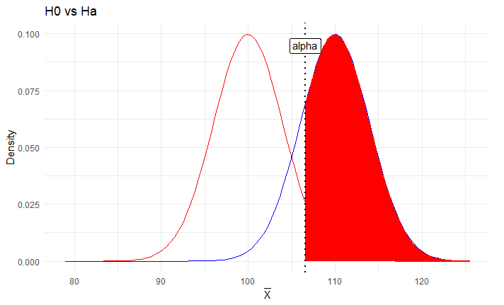

<center> <h1>Tarea 3: Frequentist Inference II </h1> </center>
<center><strong>CC6104: Statistical Thinking</strong></center>
#### **Integrantes :** 

- Alumno 1: Camila Bergasa
- Alumno 2: Matías Seda

#### **Cuerpo Docente:**

- Profesor: Felipe Bravo M.
- Auxiliar: Sebastian Bustos e Ignacio Meza D.
            

#### **Fecha límite de entrega:**

### **Índice:**

1. [Objetivo](#id1)
2. [Instrucciones](#id2)
3. [Referencias](#id3)
2. [Primera Parte: Preguntas Teóricas](#id4)
3. [Segunda Parte: Elaboración de Código](#id5)

### **Objetivo**<a name="id1"></a>

Bienvenid@s a la tercera tarea del curso Statistical Thinking. Esta tarea tiene como objetivo evaluar los contenidos teóricos de la segunda parte del curso, los cuales se enfocan principalmente en el diseño de experimentos, test de hipótesis y regresión lineal. Si aún no han visto las clases, se recomienda visitar los enlaces de las referencias.

La tarea consta de una parte teórica que busca evaluar conceptos vistos en clases. Seguido por una parte práctica con el fin de introducirlos a la programación en R enfocada en el análisis estadístico de datos. 

### **Instrucciones:**<a name="id2"></a>

- La tarea se realiza en grupos de **máximo 2 personas**. Pero no existe problema si usted desea hacer de forma individual.
- La entrega es a través de u-cursos a más tardar el día estipulado en la misma plataforma. A las tareas atrasadas se les descontará un punto por día.
- El formato de entrega es este mismo **Rmarkdown** y un **html** con la tarea desarrollada. Por favor compruebe que todas las celdas han sido ejecutadas en el archivo html.
- Al momento de la revisión tu código será ejecutado. Por favor verifica que tu entrega no tenga errores de compilación.
- No serán revisadas tareas desarrolladas en Python.
- Está **PROHIBIDO** la copia o compartir las respuestas entre integrantes de diferentes grupos.
- Pueden realizar consultas de la tarea a través de U-cursos y/o del canal de Discord del curso. 


### **Referencias:**<a name="id3"></a>

Slides de las clases:

- [Design of Experiments & Hypothesis Testing](https://github.com/dccuchile/CC6104/blob/master/slides/ST-hypothesis.pdf)
- [Linear Regression](https://github.com/dccuchile/CC6104/blob/master/slides/ST-regression.pdf)

Enlaces a videos de las clases:

- Design of Experiments & Hypothesis Testing: [video1](https://youtu.be/3MueyHnNNig) [video2](https://youtu.be/JuyIrya23E0) [video3](https://youtu.be/OXTyG6DIvK4) [video4](https://youtu.be/95QeSwrNoLI) [video5](https://youtu.be/ZCr3WCdc-54) [video6](https://youtu.be/T6ZR0KoKhBQ)
- Introduction to Statistical Inference: [video1](https://youtu.be/ZLZXJPKH6tU) [video2](https://youtu.be/mW7bHkJBcB4) [video3](https://youtu.be/SHa5Neb7bfg) [video4](https://youtu.be/rCD_jofxecY) [video5](https://youtu.be/ir4P_f3s44g) [video6](https://youtu.be/wfNhJWHPOi8)


# Primera Parte: Preguntas Teóricas<a name="id4"></a>
A continuación, se presentaran diferentes preguntas que abordan las temáticas vistas en clases. Por favor responda cada una de estas de forma breve.

#### **Pregunta 1:**
Determine si las siguientes regresiones son lineales para los parámetros $\beta_{i}$

- [ ] $y(x) = \beta_{0} + \beta_{1} x$

- [ ] $y(x) = \beta_{0} + \beta_{1} x + (\beta_{3}+x)^{3}$

- [ ] $y(x) = \ln(x^{2}+\beta_{0})$

> La primera regresión es lineal dado que es una regresión de la forma: $y(x) = \beta_{0} + \beta_{1}x$. 
> 
> Para el caso de la segunda regresión, desarrollando la expresión se tiene que:
\[ y(x) = \beta_{0} + \beta_{1} x + (\beta_{3}+x)^{3} = \beta_{0} + \beta_{1} x + \beta_{3}^3 + 3\beta_{3}^2x + 3\beta_{3}x^2 + x^3 \]
Luego, se tiene que la regresión es de la forma $y(x) = \beta_{0} + \beta_{1}x + \beta_{2}x^2 + \beta_{3}x^3$ y, como no es de la forma $y(x) = \beta_{0} + \beta_{1}x$, entonces se tiene que no es una regresión lineal.
>
> Para el caso de la tercera regresión, nótese que si las regresiones lineales son de la forma $y(x) = \beta_{0} + \beta_{1}x$, entonces se tiene que la variación de $y$ cuando cambia $x$ es constante, es decir, se tiene que:
\[ \frac{d}{dx} (y(x)) = \beta_{1} \]
Donde $\beta_{1}$ es un valor constante.
>
> Para la regresión $y(x) = \ln(x^{2}+\beta_{0})$ se tiene que $\frac{d}{dx} (y(x))$ viene dado por:
\[ \frac{d}{dx} (y(x)) = \frac{1}{x^2 + \beta_{0}}2x \]
Es claro que  $\frac{2x}{x^2 + \beta_{0}}$ no es un valor constante y, por tanto, dado que la regresión no cumple $\frac{d}{dx} (y(x)) = \beta_{0}$, es decir, $\frac{d}{dx} (y(x))$ no es un valor constate, entonces se tiene que la regresión no es lineal.

#### **Pregunta 2:**
Una universidad esta interesada en saber cuantos alumnos gustan del anime, para esto realiza una recopilación de datos y llega a la construcción del siguiente modelo lineal simple:

$$\hat{N°\_de\_fanaticos\_del\_anime}=300+90*numero\_de\_semestres$$

¿Como podemos interpretar el intercepto y pendiente del modelo?, ¿El intercepto y la pendiente tienen una interpretación coherente para cualquier modelo lineal?, si no es así, de un ejemplo.

> El modelo lineal nos dice que a medida que avanzan los semestres la cantidad de fanáticos va aumentando según esa regla. En este caso el intercepto es igual a 300, por lo que cuando las personas ingresan a la universidad y han pasado 0 semestres, el número de fanáticos de animé es igual a 300. Por otro lado, la pendiente nos dice la tasa a la cual ocurre el aumento de fanáticos de animé en cada semestre, es decir, luego del primer semestre la cantidad de fanáticos de animé será de:
>
> $300 + 90 \cdot 1= 390$, luego del segundo semestre habrán $300 + 90 \cdot 2 = 480$
>
> De esta manera, al final de la carrera (suponiendo una duración de 12 semestres) habrán $300 + 90\cdot 12 = 1.380$ fanáticos del animé.
>
> No siempre va a existir una interpretación coherente del intercepto y de la pendiente para cualquier modelo lineal, debido a que el intercepto indica el valor promedio de la variable de respuesta Y cuando X es cero, si la variable predictora X no puede asumir el valor 0, entonces la interpretación no tiene sentido, por lo que se debe tener cuidado con que X sea "número de semestres" ya que no existe el semestre 0, si no más bien se dió una interpretación ajustada mencionando que x = 0 se da cuando no ha pasado ningún semestre.


#### **Pregunta 3:**
Considere un test con dos muestras *no* aparejado, explique porque se hace una corrección a los grados de libertad en el test de Welsh.

> Para un test con dos muestras *no* aparejado, el test de Welsh realiza una corrección a los grados de libertad ya que se intenta **normalizar** el tamaño de las muestras y su desviación estándar, es decir, el test de Welsh produce grados de libertad que dependen del tamaño y desviación estándar de las muestras. En particular, el test de Welsh


#### **Pregunta 4:**

Al realizar una regresión lineal simple con una variable categórica $(\beta_{0} + \beta_{1} \cdot \text{categroica})$  ¿que interpretación puede obtenerse del coeficiente que acompaña a la variable categórica?

> En una regresión lineal simple el parámetro $\beta_{1}$ corresponde a la pendiente de la recta y representa el cambio en la variable $y$ cuando se varía el valor de la variable $x$. Mientras mayor sea la magnitud de $\beta_{1}$, mayor variación habrá en la variable $y$ al *cambiar* la variable $y$. Si $\beta_{1}$ es cercano a cero, entonces habrá una independencia lineal entre las variables, siendo la variable $x$ poco significativa para la variable de interés $y$. Dado que, en este caso, se está considerando que $x$ corresponde a una variable categórica, entonces esta variable puede tomar un valor de un número limitado de valores. Lo anteriormente mencionada genera que el coeficiente $\beta_{1}$ ponderado por el valor de la variable categoría posea una **relevancia** diferente para $y$ dependiendo del valor asignado a la categoría asociada a $x$. Por tanto. el coeficiente tendrá una significancia diferente según pertenezca a una categoría u otra.

#### **Pregunta 5:**
Discuta la siguiente frase:

"
Hacer una regresión lineal mediante máxima verosimilitud requiere tener ciertas hipótesis probabilisticas de los datos, mientras que una regresión realizada mediante mínimos cuadrados no necesita tener ninguna hipótesis probabilista.
"

> Si bien no se realiza ninguna hipótesis probabilística, cada vez que se realiza estimación por mínimos cuadrados, implícitamente se están asumiento todos los supuestos del modelo lineal probabilístico, estos son, linealidad, normalidad, independencia y homocedasticidad.

#### **Pregunta 6:**

Explique porque el test de significancia sobre los parámetros de una regresión lineal se realiza bajo la hipótesis nula $\beta_{H_{0}}=0$.

> Para el test de significancia se considera como hipótesis nula H0 el hecho de que los parámetros asociados a las variables independientes sean iguales a cero, esto es debido a que si son cercanos a cero, entonces no poseen significancia estadística e implica que existe una independencia lineal respecto de la variable de interés. Que sea cero significa que en la medida que existe una variación en $x$, esta no afectará el valor de $y$.


#### **Pregunta 7:**

¿Que nos dice la equivalencia de la máxima verosimilitud sobre los parámetros que componen una regresión lineal? ¿Qué nos permitirían calcular?

> Nos dice que las ecuaciones de los parámetros corresponden a estimadores de máxima verosimilitud, se sabe que estos estimadores poseen ciertas propiedades, son consistentes, son asíntoticamente normales, es decir, que la sampling distribution de los estimadores comienzan a converger a una gaussiana lo cual nos permite calcular intervalos de confianza sobre los estimadores, se podría generar entonces un idc para los parámetros del modelo. Esto permite tener información acerca de la variabilidad de la estimación. Se pueden realizar test de hipótesis, para testear significancia por ejemplo.

### **Pregunta 8**

Consideremos una regresión lineal de una variable. En vez de mínimos cuadrados es posible minimizar la expresión

$$
\displaystyle{\sum_{i=1}^{n}}|y_{i}-\beta_{0}-\beta_{1}x_{i}|
$$
Explique en que se diferencia con mínimos cuadrados, de una posible ventaja y desventaja de este método (en comparación a mínimos cuadrados).

>  Nótese que, generar una regresión lineal con mínimos cuadrados, permite penalizar de forma más *estricta* valores extremos (outliers), es decir, al realizar una regresión lineal con mínimos cuadradros, las curvas candidatas cercanas a los valores extremos tienden a tener errores cuadráticos grandes. En particular, matemáticamente se tiene que míminos cuadráticos penaliza de forma más severa diferencias mayores a 1 y le quita importancia a diferencias menores a 1. 
>
> Por el otro lado, la expresión dada penaliza de la misma forma todas las diferencias entre valor real ($y_{i}$) y valor predecido ($\hat{y_{i}} = \beta_{0} + \beta_{1}x_{i}$). En ese sentido, si se tiene un dataset con outliers, la curva generada con una regresión lineal utilizando la expresión dada se verá más afectada por los outliers (lo que, generalmente, no es correcto porque uno no quiere considerar tanto a los outliers). Sin embargo, si no existen outliers en los datos, entonces una regresión lineal permitiría generar una curva que consideró de *igual forma* todos los datos para su construcción (lo que se podría argumentar como algo *justo*).

#### **Pregunta 9:**
Explique porque el coeficiente $R^2$ tiende a crecer con el numero de variables.

> El coeficiente $R^2$ tiende a crecer con el número de variables explicativas consideradas en el modelo, ya que $R^2$ corresponde a una función no decreciente del número de variables exógenas o regresoras que están presentes en él. Además, $R^2$ mide la capacidad explicativa de la variable $x$ sobre la variable $y$ por lo que, al introducir en el modelo otra variable regresora, el nivel explicativo $R^2$ no disminuirá, ya que la primera variable continúa siendo explicativa. En ese sentido, ahora se tiene una mayor cantidad de variables explicativas y, por tanto, el valor de $R^2$ aumentará (o, en el peor de lo casos, se mantendrá el mismo valor para $R^22)
>
>Formalmente, se tiene que $R^{2}$ viene dado por:
\[ R^2 = 1 - \frac{SSE}{SST} = 1 - \frac{\sum_{i}^{n} (\hat{y_{i}}-y_{i})^2}{\sum_{i}^{n} (y_{i}-\bar{y})^2} \]
Nótese que $SST = \sum_{i}^{n} (y_{i}-\bar{y})^2$ es un valor constante para los datos y $SSE = \sum_{i}^{n} (\hat{y_{i}}-y_{i})^2$ depende de el modelo. En particular, para el modelo de regresión líneal simple se tiene
\[ SSE = \sum_{i}^{n} (\beta_{0} + \beta_{1}x1_{i} - y_{i})^2 \]
Definiendo $\beta_{0} + \beta_{1}x1_{i} - y_{i} = e_{i}$ se tiene:
\[ SSE = \sum_{i}^{n} e_{i}^2 \]
Ahora, para el modelo lineal multivariado con dos variables se tiene que:
\[ SSE = \sum_{i}^{n} (\beta_{0} + \beta_{1}x1_{i} + \beta_{2}x2_{i} - y_{i}) \]
Reemplazando con $e_{i}$ se tiene que:
\[ SSE = \sum_{i}^{n} (e_{i} + \beta_{2}x2_{i})^2 \]
Dado que se agrega una variable $x2_{i}$ con el propósito de *ajustar* el modelo, se tiene que $|e_{i} + \beta_{2}x2_{i}| \leq |e_{i}|$ (porque sino, no tendría sentido haber agregado la variable $x2_{i}$ al valor de la predicción). Por tanto, se tiene que el valor $SSE$ para un modelo lineal simple es mayor que el valor $SSE$ para el mismo modelo ajustado con dos variables. En consecuencia, dada la fórmula $R^2 = 1 - \frac{SSE}{SST}$, se tiene que el valor $R^2$ se mantiene o aumenta al agregar una variable más al modelo.


#### **Pregunta 10**

Un estudio de cáncer realizado por la institución X ha señalado que las personas que beben café poseen mayores probabilidades de padecer algún cáncer pulmonar.  El estudio causo un gran revuelo en la población, por lo que una segunda institución ha decidido replicar el experimento, llegando a la conclusión que las personas que toman café tienden a fumar cigarrillos mientras beben esta bebida. Señale que tipo de variable serían los fumadores de cigarrillos en el estudio de cáncer pulmonar y explique cual es la característica de estas variables.

> En el primer estudio se determinó la existencia de una correlación entre el consumo de café y el padecer un cáncer pulmonar, sin embargo, el segundo estudio demuestra que existe una correlación entre fumar cigarrillos y tomar café. De lo anterior se puede concluir que, si bien existe una correlación entre los tomar café y tener cáncer de púlmon, ésta no corresponde a una relación causal y, en realidad, existe una tercera variable implicada: fumar cigarrillos, es decir, la variable *fumar cigarrillos* generó una *confusión* entre las variables tomar café y tener cáncer pulmonar. 
>
> Lo anteriormente dicho se resume en que, inicialmente, se pensó que existía una correlación entre tomar café y tener cáncer de pulmonar, sin embargo, el primer estudio no consideró que podía existir una variable *confundiendo* la correlación entre tomar café y tener cáncer de pulmor. Dado que en el segundo estudio se mostró que hay una correlación entre tomar café y fumar cigarrillos, entonces se pudo notar que la variable fumar cigarrillos *confundía* a las otras dos variables: lo que ocurre realmente es que las personas fumadoras tienden a tomar más café y, como las personas fumadoras tiene más posibilidades de tener cáncer pulmonar, se pensó que tomar más café tiene una correlación con tener cáncer pulmonar (pero, como se mencionó anteriormente, la variable fumar cigarrillos estaba *confundiendo* la correlación, lo que realmente aumenta la probabilidad de tener cáncer pulmonar es fumar cigarrillos).

---

# Segunda Parte: Elaboración de Código<a name="id5"></a>

En la siguiente sección deberá resolver cada uno de los experimentos computacionales a través de la programación en R. Para esto se le aconseja que cree funciones en R, ya que le facilitará la ejecución de gran parte de lo solicitado.

Para el desarrollo preste mucha atención en los enunciados, ya que se le solicitará la implementación de métodos sin uso de funciones predefinidas. Por otro lado, Las librerías permitidas para desarrollar de la tarea 3 son las siguientes:

```{r}
# Manipulación de estructuras
library(tidyverse)
library(dplyr)
library(tidyr)

# Para realizar plots
library(scatterplot3d)
library(ggplot2)
library(plotly)

# Manipulación de varios plots en una imagen.
library(gridExtra)
```


## Z-test

En clases se han visto diferentes tipos de test de hipótesis para demostrar una proposición sobre algún parámetro. Uno de los test vistos en clases es el Z-Test, el cual su distribución del test estadístico bajo la hipótesis nula se puede aproximar a una Gaussina.  Para la aplicación de este test, resaltan los siguientes puntos:

-	Cada uno de los puntos de la muestra deben ser independientes unos de otros.
-	Al utilizar una distribución normal en la hipótesis nula, este test debería utilizarse cuando se tiene un número considerable de observaciones, ya que la sampling distribution de la media tiende a una gaussiana, de lo contrario se debería usar un T-test.

Para calcular la 	significancia estadística al igual que con otros métodos esta se debe calcular como:

-	Menor/Cola-Izquierda (one-tailed):  La Hipótesis Nula H0: $\mu \geq \mu0$ vs Hipótesis Alternativa H1: $\mu < \mu0$.
-	Superior/Cola-Derecha (one-tailed): La Hipótesis Nula H0: $\mu \leq \mu0$ vs Hipótesis Alternativa H1: $\mu > \mu0$.
-	Dos-Colas/Two-tailed: Hipótesis Nula H0: $\mu = \mu0$ vs Hipótesis Alternativa H1: $\mu \neq \mu0$.

Luego, dependiendo del objetivo del test tenemos las metodologías one-sample y two-sample. Utilizaremos One-Sample cuando nuestro objetivo es comparar la media de una muestra con la media de la población. El Z-score del One-Sample se define como:

$$Z-score_{One-Sample} = \dfrac{\bar x - \mu}{\dfrac{\sigma}{\sqrt n}}$$
Donde $\bar x$ es la media de la muestra, $\mu$ es la media de la población, $\sigma$ es la desviación estándar de la población y $n$ es el tamaño de la muestra.

Por otro lado, se utiliza Two-Sample cuando queremos comparar la media de dos muestras. El Z-score de Two-Sample se define con la ecuación:

$$Z-score_{Two-Sample} = \dfrac{(\bar x_1 - \bar x_2) - (\mu_1 - \mu_2)}{\sqrt{\dfrac{\sigma_1^2}{ n_1}+\dfrac{\sigma_2^2}{n_2}}}$$	
Donde $(\bar x_2 - \bar x_1)$ es la diferencia de las medias de la muestra, $(\mu_2 - \mu_1)$ la diferencia de las medias de la población, $\sigma_{1,2}$ la desviación estándar de la población y $n_{1,2}$ el tamaño de las muestras.

## Multiples Test

En la práctica aparece la necesidad de testear múltiples hipótesis (por ejemplo en biología se pueden utilizar múltiples grupos de control o querer estudiar múltiples resultados de un mismo experimento), de esta forma la primera idea es testear individualmente cada una de las hipótesis, el problema de este enfoque es que la probabilidad de que se obtenga al menos un resultado significante crece rápidamente (con un nivel de significancia $\alpha = 0.05$ y $20$ test ya se alcanza una probabilidad de $64\%$ de tener resultados significantes por azar).

Una forma de corregir los inconvenientes del método anterior es utilizar el método de **Bonferroni correction** quien propone cambiar $\alpha$ por $\alpha/m$ (donde $m$ es la cantidad de test de hipotesis realizados), esto resulta que las probabilidades de rechazar por error se mantengan bajas. De esta forma los p-valores obtenidos en un test de hipótesis y al utilizar Bonferroni correction, quedan dados por el producto de un $p-valor_{i}$ y la cantidad de test realizados: $\text{p-valor}_{i}*m$.

### Pregunta 1: "I´ve Got The Power!"
El objetivo de esta pregunta es programar la potencia de un test de hipótesis y observar como se comportan las la hipótesis nula v/s la alternativa para un Z-test. Con el desarrollo de este ejercicio, podrán visualizar las diferentes partes que conforman a un test de hipótesis, identificar que es el p-valor y evidenciar como varia la potencia de un test one-sample y two-sample al variar $\alpha$.

Para recordar; sabemos que en estadística el concepto de potencia viene dado por:

$$Power = 1 - \beta$$

Donde $\beta$ es la probabilidad de obtener un error de tipo II. Con esto, la potencia estadística viene a representar la probabilidad de rechazar la hipótesis nula cuando esta es falsa. O sea, la potencia de una prueba es la probabilidad de encontrar un resultado positivo dado que este existe. 
Una de las formas de representar la potencia de un test es a través del siguiente gráfico:


</p>

Del gráfico, es posible visualizar que a medida que aumenta la diferencia en la media de la población, se obtienen mayores valores de potencia estadística.

Recordada que es la potencia de un test de hipótesis, a continuación, usted deberá programar una función que sea capaz de obtener la potencia de un Z-test one-sample y two-sample. Para esto por favor considere los siguientes puntos:

-	Crear una función que posea los siguientes argumentos:

```r
    function(n1=NULL, sigma1=0.5, 
    n2=NULL,sigma2=0.5, mu.Ha=0 , 
    mu.True=0, alfa=0.05)
```

  De los argumentos, tendremos que: $n1$ representa la cantidad de datos para la muestra 1, $sigma1$ es la desviación estándar de la muestra 1, $n2$ la cantidad de datos para la muestra 2, $sigma2$ la desviación estándar para la muestra 2, $mu.Ha$ el mu del test de hipótesis y $mu.True$ la media de la población real. Notar que la presencia de una segunda muestra solo es para el caso two-sample, para el caso one-sample el argumento de entrada $n2$ debería ser nulo.

-	La función creada debe ser capaz de calcular el Z-test con el método One-sided (utilice solo la cola superior de la alternativa one-sided). Notar que la función al recibir un argumento nulo en $n2$ debería asumir que se trata de un test one-sample automáticamente.
- Al recibir un valor no nulo para $n2$, $mu.Ha$ representará la diferencia entre las medias de las muestras y $mu.True$ la diferencia de las medias de la población de las muestras 1 y 2.
-	La salida de la función deberá retornar la potencia del test y un plot de las gaussianas que conforman el test de hipótesis. Para el caso del plot, observe los ejemplos de plot dispuestos más abajo.

<details>
<summary>Plots One-Sample y Two-Sample</summary>
<p>

Plot One-Sample



Plot Two-Sample


Para los plots deberían obtener algo similar a las figuras expuestas, donde en los plots se pueden ver las hipótesis que componen el test y el área roja bajo la curva representa la potencia del test. 

</p>
</details>
<p>
</p>

- Si utiliza el esqueleto propuesto, complete y comente que realiza cada una de las partes de la función one-sample entregada.

Codificada la función realice los siguientes experimentos:

-	Obtener el gráfico de potencia al variar la media poblacional para los siguientes argumentos de entrada:

$$ n1=16, sigma1=16, mu.Ha=100 , mu.True=Variar, alfa=0.05 $$
$$ n1=16, sigma1=16, mu.Ha=100 , mu.True= Variar, alfa=0.01 $$
$$ n1=16, sigma1=16, mu.Ha=100 , mu.True= Variar, alfa=0.1 $$

Se le recomienda que la variación se realice a través de un `for` y grafique las curvas dentro de un mismo gráfico para observar potenciales diferencias entre ellas.

-	Diseñe un experimento one-sample y visualice cómo se comportan las distribuciones normales de la hipótesis nula y la hipótesis alternativa al variar $\alpha$.

-	Diseñe un experimento Two-sample y visualice cómo se comportan las distribuciones normales de la hipótesis nula y la hipótesis alternativa al variar $\alpha$.

Para el diseño de experimentos y/o comprobación de sus métodos puede serles útiles (no hay problema si decide utilizar los mismos ejemplos):

- one-sample: [Power Functions](https://online.stat.psu.edu/stat415/lesson/25/25.2)
- Two-Sample: [Simple Power Calculation for Two-Sample Z Test](https://ytliu0.github.io/Stat_Med/power2.html)

**Respuesta**

Inicialmene, se implemente la función `power.z.test` que permite calcula la potencia de un test de hipótesis.
```{r}
# Power Function, El esqueleto posee como ejemplo como obtener la potencia de un z-test one-sample.
# Si utiliza este esqueleto deberá comentar la función que cumple cada una de las partes entregadas
power.z.test <- function(n1=NULL, sigma1=0.5, 
                         n2=NULL,sigma2=0.5, mu.Ha=0 , 
                         mu.True=0, alfa=0.05){
  if(is.null(n2)){
    
    # Se calcula Z a partir de la función qnorm
    Z = qnorm(1-alfa)
    
    # Se calcula el denominador de la expresión asociada a Z-test
    denominador = sigma1/sqrt(n1)
    
    # Se calcula la media muestral a partir de Z
    X_bar = Z*denominador + mu.Ha
    
    # Se calcula el numerador de la expresión asociada a Z-test
    numerador = X_bar - mu.True
    
    # Se calcula el Z-test
    Z = numerador/denominador
    
    # Se calcula la potencia asociada a Z-test
    Power = 1 - pnorm(Z)
    
    # Se calculan las distribuciones normales asociadas a los
    # valores dados y calculados. En particular, son dos distribuciones:
    # una distribución asociada a la media del test de hipótesis y
    # otra distribución asociada a la media real de la población
    min_lim = min(rnorm(1000, mean=mu.Ha, sd=denominador)) - 
      round(min(rnorm(1000, mean=mu.Ha, sd=denominador)))%%10
    max_lim = max(rnorm(1000, mean=mu.True, sd=denominador)) +
      round(max(rnorm(1000, mean=mu.True, sd=denominador)))%%10
      
    # Se grafican las curvas asociadas a las distribucione normales
    # calculadas anteriormente
    plot <- ggplot(data.frame(x = c(min_lim, max_lim)), aes(x)) + 
      stat_function(fun = dnorm, args = list(mean = mu.Ha, sd = denominador), 
                    col='red') +
      stat_function(fun = dnorm, args = list(mean = mu.True, sd = denominador), 
                    col='blue') +
      stat_function(fun = dnorm, args = list(mean = mu.True, sd = denominador), 
                    xlim = c(X_bar,max_lim), geom = "area", fill='red') + 
      geom_vline(xintercept = X_bar, linetype="dotted", size=1) +
      annotate(x=X_bar, y=+Inf,label="alpha", vjust=2, geom="label") +
      theme_minimal() +
      ggtitle("H0 vs Ha") +
      xlab(expression(bar(X))) + ylab("Density")
    }
  
  
  if(!is.null(n2)){
    Z = qnorm(1-alfa)
    
    denominador = sqrt((sigma1^2/n1) + (sigma2^2/n2))
    X_bar = Z*denominador + mu.Ha
    
    numerador = X_bar - mu.True
    
    Z = numerador/denominador
    Power = 1 - pnorm(Z)
    
    # 
    min_lim = min(rnorm(1000, mean=mu.Ha, sd=denominador)) - 
      round(min(rnorm(1000, mean=mu.Ha, sd=denominador)))%%10
    max_lim = max(rnorm(1000, mean=mu.True, sd=denominador)) +
      round(max(rnorm(1000, mean=mu.True, sd=denominador)))%%10
      
    # 
    plot <- ggplot(data.frame(x = c(min_lim, max_lim)), aes(x)) + 
      stat_function(fun = dnorm, args = list(mean = mu.Ha, sd = denominador), 
                    col='red') +
      stat_function(fun = dnorm, args = list(mean = mu.True, sd = denominador), 
                    col='blue') +
      stat_function(fun = dnorm, args = list(mean = mu.True, sd = denominador), 
                    xlim = c(X_bar,max_lim), geom = "area", fill='red') + 
      geom_vline(xintercept = X_bar, linetype="dotted", size=1) +
      annotate(x=X_bar, y=+Inf,label="alpha", vjust=2, geom="label") +
      theme_minimal() +
      ggtitle("H0 vs Ha") +
      xlab(expression(bar(X1)-bar(X2))) + ylab("Density")
    }
  
  # Como R no permite retornar dos salidas usamos una lista
  # Los resultados se llaman con $plot o $power
  return(list(plot=plot,power=Power))
}

```


Con la implemetanción de la función `power.z.test`, se implementa la función `power_data` que permite crear un data frame que relaciona, dado un $\alpha$, la potencia de un z test respecto a la media real de los datos, es decir, dado un $\alpha$, se varía el valor de la media real para observar como varía la potencia del z test.
```{r}
# Plot de gráfico de potencia
power_data <- function(alfa){
  values = 90:130
  power <- c()
  for(i in values){
    z <- power.z.test(n1=16, sigma1 = 16, mu.Ha = 100, mu.True = i, alfa = alfa)
    power <- append(power, z$power)
  }
  return(data.frame(x=values, y=power))
}
```

Así, dado la función `power_data`, se crea la función `plots_power` que imprime las curvas de potencia para z tests con distintos valores de $\alpha$.
```{r}
plots_power <- function(){
  d1 <- power_data(0.01)
  d2 <- power_data(0.05)
  d3 <- power_data(0.1)
  
  ggplot() + 
    geom_line(data=d1, aes(x=x, y=y, colour="0.01")) + 
    geom_point(data=d1, aes(x=x, y=y, colour="0.01")) + 
    
    geom_line(data=d2, aes(x=x, y=y, colour="0.05"))+ 
    geom_point(data=d2, aes(x=x, y=y, colour= "0.05"))+
    
    geom_line(data=d3, aes(x=x, y=y, colour="0.1"))+
    geom_point(data=d3, aes(x=x, y=y, colour="0.1")) + 
    guides(fill=guide_legend(title="Valor alfa")) + 
    scale_colour_manual("Valores de alfa", 
                        breaks = c("0.01", "0.05", "0.1"),
                        values = c("red", "black", "blue")) + 
 
    labs(x="Valor media población", y="Valor potencia", title="Gráfico potencia para un t Test para distintos valores de alpha")
}
```


Gráfico curvas potencias.
```{r}
plots_power()
```

Ahora, para diseñar un experimento one-sample y un experimento two-sided y visualizar cómo se comportan las distribuciones normales de la hipótesis nula y la hipótesis alternativa al variar $\alpha$, se implementó la función `plot_dis` permite realizar dicho experimentos.
```{r}
# Experimentos
plot_dis <- function(n1=16, sigma1=16, 
                         n2=NULL,sigma2=16, mu.Ha=100 , 
                         mu.True=108){
  values = 1:10/100
  for(i in values){
    z <- power.z.test(n1=n1, sigma1 = sigma1, n2 = n2, sigma2 = sigma2, 
                      mu.Ha = mu.Ha, mu.True = mu.True, alfa = i)
    plot(z$plot)
  }
  return()   
  }
```


Para el caso one-sided, se tiene los siguiente gráficos:
```{r}
one <- plot_dis()
```


Por el otro lado, ara el caso two-sided, se tiene los siguiente gráficos:
```{r}
two <- plot_dis(n2=16)
```

---

### Pregunta 2: Z-test
Esta pregunta tiene como objetivo comprender como funciona un test de hipótesis y como deberíamos abordar la realización de múltiples test de hipótesis con datos reales.

La pregunta deberá ser desarrollada utilizando el dataset `marketing_campaign.csv`. Con esto, deberá programar un Z-test, con el cual estudiará a través de experimentos el `Income` de personas con los grados académicos `Graduation`, `Master` y `PhD`. Para realizar esto considere la elaboración de los siguientes puntos de forma secuencial:

- Modificar el dataframe entregado generando un estructura apta para el test de hipótesis. Una estructura que se les aconseja utilizar son vectores con los valores que representan a los grados académicos `Graduation`, `Master` y `PhD` por separado.

<details>
<summary>Ejemplo de estructura</summary>
<p>

Por ejemplo para el caso de Graduation pueden generar estructuras de la siguiente forma:

| ID   | Graduation |
|------|------------|
| 5524 | 58138      |
| 2174 | 46344      |
| 4141 | 71613      |
| 6182 | 26646      |
| 965  | 55635      |
| ...  | ...        |

Donde los valores en la fila de Graduation representan los sueldos de las diferentes personas que conforman el dataset. Un punto importante a considerar es que los datos para los diferentes grados académicos poseen diferentes numero de datos (no se asusten por esto).

</p>
</details>
<p>
</p>

- Programar el método Z-test con la metodología one sample y two sample, obteniendo los p-valores a través de las alternativas one-sided y two-sided. Para el caso de one-sided, cree una función capaz de obtener la cola menor y mayor de la gaussiana.

- El calculo de las diferentes alternativas para calcular los p-valores deberá ser un argumento de su función, donde señalando 'menor','mayor' (para los casos one-sided) y 'two-sided' deberá obtener el valor pertinente para cada caso.

- Genere una función que permita realizar solo múltiples test del tipo two-sample y aplique bonferroni correction a los p-valores obtenidos. Notar que los múltiples test deberá realizar la comparación entre todos los elementos de entrada, por ejemplo si deseamos comparar los ingresos de `Graduation`, `Master` y `PhD`, se deberían comparar los ingresos de `Graduation` v/s `Master`, `Graduation` v/s `PhD` y `Master` y `PhD`

Codificada las funciones, realice los siguientes experimentos con su función de test de hipótesis:

- Compruebe si la media de los ingresos para la variable `Graduation` es similar a 52000. Señale formalmente este experimento y obtenga los p-valores para las alternativas one-sided y two-sided.

- Compruebe si la diferencia entre los ingresos de las personas con el grado académico `Graduation` es cercana a cero en relación a la recibida por los `Master` y `PhD`. Para este punto utilice la función que le permite realizar múltiples test del tipo two-sample.

Para los diferentes experimentos considere que la desviación estandar de la población para los diferentes `income` son los siguientes:

$$\sigma_{Graduation} = 28180$$
$$\sigma_{Master} = 20160$$
$$\sigma_{PhD} = 20615$$

**Respuesta:**

Inicialmente, se **formatea** la data para que sea apta para los test de hipótesis.
```{r}
df = read.csv('marketing_campaign.csv', sep='\t')

# grad 
grad = df[df$Education == "Graduation", ]
grad = grad[c("ID", "Income")]
grad = na.omit(grad)

master = df[df$Education == "Master", ]
master = master[c("ID", "Income")]
master = na.omit(master)

phd = df[df$Education == "PhD", ]
phd = phd[c("ID", "Income")]
phd = na.omit(phd)
```


Se implementa la función `z_test` con la metodología one sample y two sample, permitiendo obtener los p-valores a través de las alternativas one-sided y two-sided. 
```{r}
# Implementación de Z-test one-sided y two-sided
# Puede utilizar este esqueleto
z_test <- function(data1=NULL, sigma1=0.5, data2=NULL, sigma2=0.5, 
                   mu.Ha=0, test.type = c('one-sided','two-sided'),
                   verbose=TRUE){
  
  if(length(test.type)>=2){
    print("Por favor escoge un tipo de Test: ´one-sided´ o ´two-sided´ ")
    return()
  }
  else if(length(test.type)==1 && !(test.type %in% c('menor','mayor','two-sided'))){
    print("Por favor escoge un tipo de Test: ´menor´, ´mayor´ o ´two-sided´")
    return()
  }
  else if(is.null(data2)){
    n = nrow(data1)
    x_bar = mean(data1$Income)
    se <- sigma1/sqrt(n)
    
    Z_score <- (x_bar- mu.Ha)/se
    # P-value
    if(test.type=='menor'){
     p_value <- 1 - pt(Z_score, df = n-1)
    }
    else if(test.type=='mayor'){
      p_value <- pt(-Z_score, df = n-1)
    }
    else if(test.type=='two-sided'){
      p_value <- 2*pt(-abs(Z_score), df = n-1)
    }
    # Texto de Salida
    if(verbose){
      cat("\tOne-sample Z-Test:\n\nData analizada:",
                      deparse(substitute(data1)), "\nZ=", Z_score, 
                      "P-value=", p_value, "\n\n",sep=" ")
    }
    return(p_value)
    
  }
  else if(!is.null(data2)){
    # Hypothesis test
    n1 = nrow(data1)
    n2 = nrow(data2)
    
    x1_bar = mean(data1$Income)
    x2_bar = mean(data2$Income)
    
    se1 <-(sigma1^2)/n1
    se2 <-(sigma2^2)/n2
    
    Z_score <- (x1_bar- x2_bar - mu.Ha)/sqrt(se1 + se2)
    
    up <- (se1 + se2)^2
    down <- (se1^2)/(n1-1) + (se2^2)/(n2-1)
    df <- up/down
 
    # p-value
    if(test.type=='menor'){
      p_value <- 1 - pt(Z_score, df = df)
    }
    else if(test.type=='mayor'){
      p_value <- pt(-Z_score, df = df)
    }
    else if(test.type=='two-sided'){
      p_value <- 2*pt(-abs(Z_score), df = df)
    }
      
    # Texto de Salida
    if(verbose){
      cat("\tTwo-sample Z-Test:\n\nData analizada:",
                      deparse(substitute(data1)),"y",
                      deparse(substitute(data2)), "\nZ=", 
                      Z_score, "P-value=", p_value, "\n\n",sep=" ")
    }
  
    return(p_value)
  }
}
```


Ahora, dada la función `z_test` se puede comprobar si la media de los ingresos para la variable Graduation es similar a 52000. En particular, definiendo la hipótesis nula $H_{0}: \mu = 52000$ y la hipótesis alternativa $H_{1}: \mu \geq 52000$, se tiene que el z test al $5\%$ es el siguiente:
```{r}
p_grad_less <- z_test(data1=grad, sigma1=28180, mu.Ha=52000, test.type = 'mayor', verbose=TRUE)
```

Dado que el p valor obtenido es mayor que $0.05$, no existe evidencia estadística para rechazar la hipótesis nula.


Por el otro lado, de forma homóloga,  definiendo la hipótesis nula $H_{0}: \mu = 52000$ y la hipótesis alternativa $H_{1}: \mu \leq 52000$, se tiene que el z test al $5\%$ es el siguiente:
```{r}
p_grad_less <- z_test(data1=grad, sigma1=28180, mu.Ha=52000, test.type = 'menor', verbose=TRUE)
```

Nuevamente, dado que el p valor obtenido es mayor que $0.05$, no existe evidencia estadística para rechazar la hipótesis nula.

Finalmente, para el caso two-sided definiendo la hipótesis nula $H_{0}: \mu = 52000$ y la hipótesis alternativa $H_{1}: \mu \neq 52000$, se tiene que el z test al $5\%$ es el siguiente:
`
```{r}
p_grad_less <- z_test(data1=grad, sigma1=28180, mu.Ha=52000, test.type = 'two-sided', verbose=TRUE)
```

Dado que el p valor obtenido es mayor que $0.05$, no existe evidencia estadística para rechazar la hipótesis nula. 

Por tanto, dado los tests realizados, se puede comprobar que la media de los ingresos para la variable `Graduation` es similar a 52000.

Siguiendo el desarrollo del enunciado, `z.test.multiple_testing` que permite realizar solo múltiples test del tipo two-sample.
```{r}
z.test.multiple_testing <- function(list_data, sigma_data, mu.Ha = 0){
  
  
  p_values <- c()
  for (i in 1:(length(list_data)-1)){
    for(j in (i+1):length(list_data)){
      p <- z_test(data1=list_data[[i]], data2=list_data[[j]], sigma1=sigma_data[i], 
                  sigma2=sigma_data[j], mu.Ha= mu.Ha, test.type = 'two-sided', verbose=FALSE)
      p_values <- append(p_values, p)
    }
  }
  return(p_values)
}
```


Para comparar si los ingresos entre Graduation, Master y PhD es cercana a 0, el siguiente bloque de código permite realizar los z tests correspondientes.
```{r}
list_data <- list(grad, master, phd)
list_sigma <- c(28180, 20160, 20615)
p_values <- z.test.multiple_testing(list_data, list_sigma)
```


En particular, para el test donde la hipótesis nula es $H_{0}: \mu_{Graduation} - \mu_{Master} = 0 $ y la hipótesis alternativa es $H_{1}: \mu_{Graduation} \neq \mu_{Master}$, se tiene el siguiente p valor.
```{r}
p_value_grad_master <- p_values[1]
p_value_grad_master
```


Del mismo modo, el p valor corregido para dicho test es:
```{r}
p_value_grad_master*2
```


Así, dado el test a $5\%$, se tiene que no existe evidencia estadística para rechazar la hipótesis nula, es decir, la diferencia de ingresos entre las personas con el grado académico `Graduation` y las personas con el grado académico `Master` es cercana a 0.


Por el otro lado, para el test donde la hipótesis nula es $H_{0}: \mu_{Graduation} - \mu_{PhD} = 0$ y la hipótesis alternativa es $H_{1}: \mu_{Graduation} \neq \mu_{PhD}$, se tiene el siguiente p valor.
```{r}
p_value_grad_phd<- p_values[2]
p_value_grad_phd
```

Del mismo modo, el p valor corregido para dicho test es:
```{r}
p_value_grad_phd*2
```

Así, dado el test a $5\%$, se tiene que existe evidencia estadística para rechazar la hipótesis nula, es decir, la diferencia de ingresos entre las personas con el grado académico `Graduation` y las personas con el grado académico `PhD` no es cercana a 0, es decir, existe una diferencia **estadísticamente significativa** entre el ingreso de las personas con el grado académico `Graduation` y las personas con el grado académico `PhD`.


### Pregunta 3: Testeando multiples hipotesis y Bonferroni Correction

El objetivo de este problema es estudiar como realizar múltiples test de hipótesis simultáneamente. Para esto en primer lugar se estudiara el método "intuitivo", donde veremos sus limitantes y se comparará con el método llamado **Bonferroni correction**, posteriormente se realizará un estudio practico con el dataset `ratones.csv`.

Un investigador se ha colocado en contacto con ustedes señalándoles que realiza diariamente test de hipótesis entre las muestras que toma día a día en su laboratorio. Con esto, al investigador le urge saber si realizar multiples test de hipótesis sin una corrección podría afectar la toma de decisiones. Para comprobar esto, les solicita comprobar matemáticamente como se comporta la probabilidad de obtener al menos un resultado significativos al azar de sus experimentos diarios. Para esto, les señala que la la probabilidad de obtener un experimento por azar puede ser simulado a través de los casos exitosos de una binomial (valores mayores a cero), donde el numero de observaciones son la cantidad de experimentos ($m$) y la probabilidad queda dada por $\alpha$ del test.

A continuación, se entregan unas indicaciones mas especificas para desarrollar la pregunta:

- [ ] Complete el código presentado a continuación que le permite calcular la probabilidad empírica de que obtenga al menos un resultado significativo para significancia $\alpha$ y cantidad de experimentos $m$ arbitrarios.
- [ ] Se puede verificar que para un nivel de significancia $\alpha$ y $m$ experimentos independientes la probabilidad de que se tenga al menos un resultado significativo por azar es 
$$\mathbb{P}(\text{obtener al menos resultado significativo por azar})=1-(1-\alpha)^{m}$$
- [ ] Considere $\alpha = 0.05$, grafique la probabilidad empírica y real variando el valor de $m$ ¿Se parecen sus resultados? ¿Que sucede cuando la cantidad de experimentos crece mucho? ¿Este comportamiento depende del valor de significancia $\alpha$? ¿Es útil este método para la realización de múltiples test de hipótesis?
- [ ] Para solucionar los inconvenientes del método anterior es posible utilizar el método de **Bonferroni correction**, modifique su código anterior para verificar lo anterior ¿Mejoran los resultados? ¿cual podría ser un problema si es que $m$ es muy grande?
- [ ] Ejecute el siguiente código que calcula el $p$-valor usual y el $p$-valor asociado a Bonferroni (que corresponde al $p$-valor * m donde $m$ es el numero de experimentos), ¿Cuantos valores que originalmente se hubieran aceptado fueron rechazados si $\alpha = 0.05$? ¿Que implica esto sobre el nivel de falsos negativos de este metodo?


**Respuesta Aquí:**

Para calcular la probabilidad empírica de los experimentos, se implemento la función `probEmpirica` que permite calcular dicha probabilidad.
```{r}
probEmpirica <- function(alpha, m, bonfe = FALSE){
  n <- 100 # Cantidad de veces que se va a repetir el experimento para estimar la probabilidad, pueden cambiar este valor si lo desean
  
  res <- rbinom(n, m, alpha)
  
  # Puede agergar todo el codigo que estime conveniente para calcular la probabilidad empirica
  if(bonfe){
    res <- rbinom(n, m, alpha/m)
  }
  else{
    res <- rbinom(n, m, alpha)
  }
  
  prob <- length(res[res>0])/n
  
  return(prob)
}
```


Ahora, dado la función `probEmpirica`, se quiere observar como varía la probabilidad real y la probabilidad empírica en relación a la cantidad de experimentos realizados. La función `plot_probs` permite graficar dichas curvas.
```{r}
plot_probs <- function(n, alpha, bonfe = FALSE){
  probs_emp <- c()
  probs_real <- c()
  
  if(bonfe){
    probs_emp_bonfe <- c()
    probs_real_bonfe <- c()
  }
 
  for(i in 1:n){
    p1 <- probEmpirica(alpha, i)
    p2 <- 1 - (1-alpha)^i
    
    probs_emp <- append(probs_emp, p1)
    probs_real <- append(probs_real, p2)
    
    if (bonfe){
      p3 <- probEmpirica(alpha, i , bonfe = bonfe)
      p4 <- 1 - (1-alpha/i)^i
      
      probs_emp_bonfe <- append(probs_emp_bonfe, p3)
      probs_real_bonfe <- append(probs_real_bonfe, p4)
      }
    }
  
  d1 = data.frame(x=1:n, y=probs_emp)
  d2 = data.frame(x=1:n, y=probs_real)
  
  plot <- ggplot() + 
    geom_line(data=d1, aes(x=x, y=y, colour="Empírica sin correción")) + 
    geom_line(data=d2, aes(x=x, y=y, colour="Real sin correción"))
  
  if (bonfe){
    d3 = data.frame(x=1:n, y=probs_emp_bonfe)
    d4 = data.frame(x=1:n, y=probs_real_bonfe)
    
    plot <- plot + 
      geom_line(data=d3, aes(x=x, y=y, colour="Empírica con correción")) + 
      geom_line(data=d4, aes(x=x, y=y, colour="Real con correción")) + 
      guides(fill=guide_legend(title="Tipo probabilidad")) + 
      scale_colour_manual("Tipo de probabilidad", 
                          # breaks = c("Empírica sin corrección", "Real sin correción","Empírica con corrección", "Real con correción"),
                          values = c("red", "blue", "black", "green")
      )
    }
  else{
    plot <- plot + 
       guides(fill=guide_legend(title="Tipo probabilidad")) + 
      scale_colour_manual("Tipo de probabilidad", 
                          breaks = c("Empírica sin correción", "Real sin correción"),
                          values = c("red", "blue")) 
  }
  plot <- plot + 
    labs(x="Valor m (cantidad experimentos)", y="Probabilidad de obtener \n al menos un experimento exitoso", title=paste("Probabilidades del evento con alfa = ", alpha))
  
  return(plot)
}
```


Para el caso sin corrección, se tiene que las curvas mencionadas son la siguientes:
```{r}
plots_no_bonfe <- plot_probs(500, 0.05, bonfe = TRUE)
plot(plots_no_bonfe)
```

Dado el gráfico, se tiene que, en primer lugar, la curva asociada a la probabilidad real es similar a la curva asociada a la probabilidad empírica. Asimismo, se puede notar que, a medida que crece la cantidad de experimentos realizados, tanto la probabilidad real como la probabilidad empírica tienden a $1$. En particular, para $m \geq 100$ se tiene que ambas probabilidades con tienden a 1. Asímismo, se tiene que para $m \geq 20$, ambas probabilidades son mayores al $50\%$ y, por tanto, existe mayor probabilidad de tener un experimento exitoso por **azar** y, por tanto, se obtendrían resultados estadísticos significativos por mero azar (lo que es algo que, evidentemente, no se quiere obtener en un experimento).

Nótese que al aumentar el valor de $\alpha$ se tiene el siguiente comportamiento:
```{r}
plots_no_bonfe <- plot_probs(500, 0.1)
plot(plots_no_bonfe)
```

Del gráfico anterior se observa que, al aumentar $\alpha$, se necesita una cantidad menor de experimentos para lograr que ambas probabilidades tiendan a 1.

Ahora, las curvas con correción son las siguientes:
```{r}
plots_no_bonfe <- plot_probs(500, 0.05, bonfe = TRUE)
plot(plots_no_bonfe)
```

Nótese que con la correción de Bonferroni se tiene que las probabilidades se mantienen constantes respecto a la cantidad de test realizados. Por tanto, se tiene que la correción de Bonferroni mejora los resultados dado que ambas probabilidades ya no dependen de la cantidad de experimentos y, en consecuencia, con la correción ya no se obtendrían resultados estadísticos significativos por mero azar.

Respecto al dataset `ratones.csv` se tiene la siguiente estructura:
```{r}
ratones <- read.csv("ratones.csv",sep= ";")
head(ratones)
```

Inicialmente, los siguientes grupos de ratones obtuvieron un p valor menor a $0.05$
```{r}
ratones_no_bonfe <- ratones[ratones$p.value < "0,05", ]
ratones_no_bonfe
```


Nótese que, orginalmente, se tienen 8 grupos de ratones con p valores menores que $0.05$. Sin embargo, con la corrección de bonferroni, existen mucho grupos de ratones que aumentaron su p valor por un umbral mayor que $0.05$. En particular, los siguientes grupos de ratones son los únicos que obtuvieron un p valor corregido menor que $0.05$
```{r}
ratones_bonfe <- ratones[ratones$p.value.Bonferroni < "0,05", ]
ratones_bonfe 
```

Es decir, de los 8 grupos originales de ratones que obtuvieron experimentos exitosos, solo un 2 grupos se mantuvieron como exitosos luego de la correción de bonferroni, es decir, solo el $25 \%$ del total de exitosos se mantuvo luego de la correción. 


---

### Pregunta 4: Regression Lineal sin comandos.
El objetivo de la siguiente pregunta es aplicar los conceptos de regresión lineal vistos en clases para implementar desde cero un función capaz de realizar una regresión simple y múltiple.

Para este problema, ustedes deberán estudiar el comportamiento de los clientes de un holding de salud. Para esto, se les hace entrega del dataset `insurance.csv` para que estudien la creación de un modelo lineal con sus datos. Antes de comenzar a trabajar, se señalan las diferentes variables que componen al dataset:

- age: Señala la edad de cada uno de los sujetos.
- sex: Si es mujer es igual a 1, si es hombre es igual a 0.
- bmi: Indice de masa corporal del cliente.
- children: Señala cuantos hijos tiene cada uno de los sujetos.
- smoker: Variable binaria que cuando es 1 señala que el cliente es fumador (0 en caso contrario).
- charges: Gastos médicos de cada uno de los clientes.

Es importante que considere que cada una de las filas representa un cliente distinto para el holding.

Dentro del estudio, el holding de salud le solicita estudiar los comportamientos de los clientes fumadores y no fumadores, por lo que se le aconseja separar el dataframe original en fumadores y no fumadores. En el estudio, realicen un modelo lineal que tiene como variable de respuesta a `charges` y los datos que mejor se correlacionan para los clientes fumadores y no fumadores. Para esto, deberán realizar las siguientes actividades:

#### Parte I
a) Programe un modelo lineal simple escogiendo la variable numérica que tiene mayor relación con la variable de respuesta. Recuerde justificar la elección de la variable numérica cuantitativamente.
b) Señale tanto el $R^2$ como el $R^2-adjustado$ del modelo.
c) Grafique el scatterplot de los datos y la linea que ajusta a la regresión lineal obtenida.

#### Parte II
a) Entrene un modelo lineal multivariable escogiendo dos variables numéricas que posean la mayor relación con `charges`.
b) Estudie si el modelo multivariable posee mejor desempeño que el modelo simple y comente los resultados. ¿Es recomendable la utilización de los modelos creados para la predicción de nuevas entradas?. Para este análisis puede utilizar los valores de test de hipótesis entregados por el comando `lm()`, ya que esto le servirá para observar si la regresión lineal es significativa.

**Nota:** No esta permitido utilizar comandos que obtengan los valores solicitados directamente a menos que se le permita en la pregunta.


Inicialmente, para construir la funcion `lm_reg` se crearon dos funciones auxiliares `get_vector_B` y `remove_name` que se se utilizarán en la función `lm_reg` 
```{r}
get_vector_B <- function(X, Y){
  X <- cbind(rep(1, length(X[, 1])), X)
  return(solve(t(X)%*%X)%*%t(X)%*%Y)
}

remove_name <- function(vec, name){
  return(vec[! vec %in% c(name)])
}
```


Respecto a la función `lm_reg`, ésta toma como argumento un dataframe `X`, el nombre de la variable objetivo `y_name` y la cantidad de variables que considerará la regresión (por defecto, será una regresión líneal simple)
```{r}
lm_reg <- function(X, y_name, vars = 1){
  nms <- remove_name(names(X), y_name)
  
  Y <- X[, y_name]
  new_nms <- c()
  
  for(i in 1:vars){
    max_cor <- 0
    name_max_cor <- ""
    k <- 0
    k_max <- 0
    for (j in nms){
      k <- k + 1
      X_cor <- X[, j]
      current_cor <- cor(Y, X_cor)
      if (max_cor < current_cor){
        max_cor <- current_cor
        name_max_cor <- j 
        k_max <- k
        }
    }
    new_nms <- append(new_nms, name_max_cor)
    if( i == 1){
      new_data = data.frame(name_max_cor=X[, name_max_cor])
    }
    else{
        new_data[name_max_cor] = X[, name_max_cor]
        }
    nms <- remove_name(nms, name_max_cor)
  }
  names(new_data) <- new_nms
  
  matrix_data <- as.matrix(new_data)
  b_vector <- get_vector_B(matrix_data, matrix(Y))
  new_data$y = cbind(rep(1, length(matrix_data[, 1])), matrix_data)%*%b_vector
  
  return(list(data=new_data, beta=b_vector))
}
```


Finalmenete , se implementará la función `plot_reg` que permitirá graficar una regresión lineal simple.
```{r}
plot_reg <- function(data1, data2, x_name, type){
  data1 <- data.frame(x=data1[, x_name], y = data1$charges)
  data2 <- data.frame(x=data2[, x_name], y = data2$y)
  ggplot() +
    geom_point(
      data=data1, 
      aes(x=x, y=y, colour="Datos originales")) +
    geom_line(
      data = data2,
      aes(x=x, y=y, colour="Regresión")) + 
    guides(fill=guide_legend(title="")) + 
    scale_colour_manual("", 
                        breaks = c("Datos originales", "Regresión"),
                        values = c("red", "black")) + 
    labs(x=x_name, y="Charges", title=paste("Regresión lineal para dataset ", type))
}
```


Con las funciones `lm_reg` y `plot_reg` implementadas, se procederá a leer el data set `insurance` y preparar dicho data set que crear las regresiones respectivas y sus plots.
```{r}
insurance <- read.csv("insurance.csv")

# categorical to numeric
sex_number <- c("female"=0, "male"=1)
region_number <- c("southwest"=0, "southeast"=1, "northwest"=2, "northeast"=3)
insurance$sex <- sex_number[insurance$sex]
insurance$region <- region_number[insurance$region]

#Separar dataset en fumadores y no fumadores

#Fumadores
df_f <- insurance[insurance$smoker == 'yes', ]
df_f <- subset(df_f, select = c(-smoker))

#No fumadores
df_no_f <- insurance[insurance$smoker == 'no', ]
df_no_f <- subset(df_no_f, select = c(-smoker))
```


Dado el data set de fumadores, se creará una regresión lineal simple con `charges` como variable objetivo. Nótese que la función `lm_reg` escogerá entre las variables restantes la variable que mejor se relaciona con `charges` para realizar la regresión lineal con dicha variable.
```{r}
df_f_reg <- lm_reg(df_f, "charges")
head(df_f_reg$data)
```


Del bloque de código anterior se puede notar que, para el dataset de fumadores, la función `lm_reg` escogió la variable `bmi` para realizar la regresión. El gráfico de la regresión lineal es el siguiente:
```{r}
plot_reg(df_f, df_f_reg$data, "bmi", "fumadores")
```


Respecto al dataset de los no fumadores, se repitió el procedimiento menconado.
```{r}
df_no_f_reg <- lm_reg(df_no_f , "charges")
head(df_no_f_reg$data)
```


En este caso, se puede nota que, para el dataset de no fumadores, la función `lm_reg` escogió la variable `age` para realizar la regresión. El gráfico de la regresión lineal es el siguiente:
```{r}
plot_reg(df_no_f, df_no_f_reg$data, "age", "fumadores")
```


Ahora, para calcular el $R^2$ y $R^2$ ajustado, la función `calculate_R` permite realizar dichas acciones.
```{r}
calculate_R <- function(v1, v2, adjusted = FALSE, vars = 1){
  y_bar <- mean(v1)
  SST <- sum((v1 - y_bar)^2)
  SSM <- sum((v2 - y_bar)^2)
  R <- SSM/SST
  if(adjusted){
    n <- length(v1)
    R <- 1 - (1 - R)*((n-1)/(n-vars-1))
  }
  return(R)
}
```


Para la regresión lineal simple para el dataset de fumadores, se tiene que el $R^2$ es el siguiente:
```{r}
calculate_R(df_f$charges, df_f_reg$data$y)
```


Para el mismo dataset, el $R^2$ ajustado es el siguiente:
```{r}
calculate_R(df_f$charges, df_f_reg$data$y, adjusted = TRUE)
```


En el otro caso, para la regresión lineal simple para el dataset de no fumadores, se tiene que el $R^2$ es el siguiente:
```{r}
calculate_R(df_no_f$charges, df_no_f_reg$data$y)
```


Asimismo, para el mismo dataset, el $R^2$ ajustado es el siguiente:
```{r}
calculate_R(df_no_f$charges, df_no_f_reg$data$y, adjusted = TRUE)
```


Ahora, dado el data set de fumadores, se creará una regresión lineal multivariada con `charges` como variable objetivo. En particular, se escogerán dos variables para realizar la regresión. Nótese que la función `lm_reg` escogerá entre las variables restantes la dos variable que mejor se relaciona con `charges` para realizar la regresión lineal multivariada con dicha variable.
```{r}
df_f_reg_2 <- lm_reg(df_f, "charges", 2)
head(df_f_reg_2$data)
```

Del bloque de código anterior se puede notar que, para el dataset de fumadores, la función `lm_reg` escogió las variables `bmi` y `age` para realizar la regresión. 


Respecto al dataset de los no fumadores, se repitió el procedimiento menconado.
```{r}
df_no_f_reg_2 <- lm_reg(df_no_f , "charges", 2)
head(df_no_f_reg_2$data)
```


En este caso, se puede nota que, para el dataset de no fumadores, la función `lm_reg` escogió las variables `age`  y `children` para realizar la regresión.


Ahora, para la regresión lineal multivariada para el dataset de fumadores, se tiene que el $R^2$ es el siguiente:
```{r}
calculate_R(df_f$charges, df_f_reg_2$data$y)
```


Para el mismo dataset, el $R^2$ ajustado es el siguiente:
```{r}
calculate_R(df_f$charges, df_f_reg_2$data$y, adjusted = TRUE, vars = 2)
```


En el otro caso, para la regresión lineal multivariada para el dataset de no fumadores, se tiene que el $R^2$ es el siguiente:
```{r}
calculate_R(df_no_f$charges, df_no_f_reg_2$data$y)
```


Para el mismo dataset, el $R^2$ ajustado es el siguiente:
```{r}
calculate_R(df_no_f$charges, df_no_f_reg_2$data$y, adjusted = TRUE, vars = 2)
```

Nótese que, para ambas datasets, la regresión lineal multivariada obtiene mejores valores tanto para el $R^2$ como para el $R^2$ ajustado. En particular, la diferencia de los valores del $R^2$ y el $R^2$ ajustado de la regresión lineal simple para el dataset no fumadores versus los valores del $R^2$ y el $R^2$ ajustado de la regresión lineal multivariada para el dataset no fumadores no es tan significativa. Sin embargo, para el dataset fumadores, la diferencia es más significativa.


Respecto a los p valores para el dataset de fumadores, tanto para la regresión lineal simple como para la regresion lineal multivariada se tiene lo siguiente:
```{r}
summary(lm(df_f$charges~df_f$bmi))
```


```{r}
summary(lm(df_no_f$charges~df_no_f$age))
```

Para ambas regresiones se puede observar que, el p valor es menor que 0.05 y, por lo tanto, se rechaza la hipótesis nula de que los coeficientes asociados a las variables regresoras sean iguales a cero o no significativas. En particular, se aprecia tanto en la regresión lineal simple, que considera el índice de masa corporal como variable explicativa, como en la regresión lineal multivariada que considera como variables regresoras al índice de masa corporal y a la edad. Los asteriscos también indican significancia estadísitica por parte de esas variables.

Por el otro lado, respecto a los p valores para el dataset de fumadores, tanto para la regresión lineal simple como para la regresion lineal multivariada se tiene lo siguiente:
```{r}
summary(lm(df_f$charges~df_f$bmi+df_f$age))
```


```{r}
summary(lm(df_no_f$charges~df_no_f$age+df_no_f$children))
```


Para ambas regresiones se puede observar que, el p valor es menor que 0.05 y, por tanto, se se rechaza la hipótesis nula de que los coeficientes asociados a las variables regresoras sean iguales a cero o no significativas. En particular, se aprecia tanto  tanto en la regresión lineal simple, que considera la edad, como en la regresión multivariada donde las variables regresoras son edad y cantidad de hijos. Nuevamente, los asteriscos también indican significancia estadísitica por parte de esas variables.

&nbsp;
<hr />
<p style="text-align: center;">A work by <a href="https://github.com/dccuchile/CC6104">CC6104</a></p>

<!-- Add icon library -->
<link rel="stylesheet" href="https://use.fontawesome.com/releases/v5.6.1/css/all.css">

<!-- Add font awesome icons -->
<p style="text-align: center;">
    <a href="https://github.com/dccuchile/CC6104"><i class="fab fa-github" style='font-size:30px'></i></a>
    <a href="https://discord.gg/XCbQvGs3Uf"><i class="fab fa-discord" style='font-size:30px'></i></a>
</p>

&nbsp;
